# FlexKV-OS（Flexible Weight-KV Runtime Memory System）


## 一、基本信息

### 1.1 项目与队伍信息

| 项目 | 内容 |
| :---: | --- |
| **项目名称** | FlexKV-OS：面向内存受限环境的大模型运行时内存治理系统 |
| **基础框架** | llama.cpp / ggml |
| **优化方向** | 大模型推理运行时内存治理、Dense 权重驻留、MoE 专家工作集、KV Cache 生命周期与全局资源调度 |
| **适用场景** | 边缘设备、本地低内存环境、Linux CPU 推理、长上下文与多会话场景 |
| **小组成员** | 苏安炫、李思甜 |
| **项目导师** | 夏文、李诗逸 |
| **仓库地址** | https://gitlab.eduxiji.net/T2026181239911430/project3136859-389161 |
| **参赛文档** | [参赛文档](./docs/参赛文档.pdf) |

### 1.2 摘要

随着大语言模型逐步由云端数据中心向个人计算机、边缘设备及嵌入式平台迁移，有限物理内存和存储带宽逐渐成为端侧大模型部署的重要约束。Dense 模型需要持续按层访问全部权重，MoE 模型每次仅激活少量专家，KV Cache 则会随上下文长度和并发会话不断增长。三类数据访问规律不同，却共同竞争有限的物理内存与 I/O 资源，单纯依赖操作系统被动调页难以同时兼顾内存占用、数据访问开销和推理性能。

针对上述问题，本项目基于 llama.cpp / ggml 设计并实现 **FlexKV-OS**，构建面向内存受限环境的运行时内存治理系统。系统采用“加载期规划 + 运行期治理”的两阶段架构：加载阶段由内存规划器（Memory Planner）根据系统内存约束、模型规模与结构生成初始资源配置；运行阶段由全局内存控制器（Server Memory Governor）持续感知内存压力和各模块工作集状态，动态协调数据驻留、回收、预取与资源再分配。

针对不同数据对象，系统采用差异化管理机制：**Dense Flex** 利用模型逐层访问规律维护有限层工作集；**MoE Buffer** 根据专家稀疏激活特征维护动态专家工作集；**KV Cache** 将会话逻辑状态与物理驻留状态解耦，根据生命周期执行直接释放、按需换出与精确恢复。在此基础上，全局内存控制器统一协调三类工作集及其预取任务，使局部优化能够共享同一物理内存与 I/O 资源，形成完整的运行时资源治理闭环。

实验结果表明，FlexKV-OS 能够在受限内存环境下降低大模型推理的真实物理内存占用，并改善模型可运行性和推理吞吐。在统一自动调度配置 combined_auto 下，Dense 模型相对原生  llama.cpp 的峰值 RSS 由 **2801.96 MB 降至 2597.89 MB**，减少 **204.07 MB（7.28%）**，吞吐由 **3.090 tok/s 提升至 4.727 tok/s**，提升 **52.97%（约 1.53×）**；MoE 模型峰值 RSS 由 **2800.92 MB 降至 1954.75 MB**，减少 **846.17 MB（30.21%）**，吞吐由 **7.339 tok/s 提升至 11.463 tok/s**，提升 **56.19%（约 1.56×）**。

### 1.3 主要工作

- **构建面向大模型推理的运行时内存治理框架**  
  在 llama.cpp / ggml 中引入加载期资源规划和运行期全局控制，将 Dense 权重、MoE 专家、KV Cache 与预取资源统一纳入内存管理体系。

- **实现 Dense 模型的层级权重驻留管理**  
  利用 Dense 模型固定的逐层访问规律维护有限层工作集，通过权重驻留、回收和提前读取减少重复权重访问与 I/O 等待。

- **实现 MoE 模型的专家动态工作集**  
  以专家为管理粒度，根据实际访问、历史热度和预测结果动态维护专家工作集，并结合压力感知保护与自动预算适应不同内存条件。

- **实现 KV Cache 生命周期与动态物理驻留管理**  
  将 KV 的逻辑会话状态与物理驻留状态解耦：对无恢复价值的 KV 直接释放，对仍有会话价值的 KV 按需换出，并在会话重访前完成精确恢复。

- **实现统一预取与全局资源调度**  
  协调 Dense 权重、MoE 专家和 KV 恢复产生的预取与 I/O 请求；全局内存控制器根据内存压力、可用空间和工作集收益调整资源，并将真实释放的物理内存重新分配给当前更高价值的工作集。

- **建立系统化实验与正确性验证体系**  
  通过受限内存实验、RSS 与真实物理驻留观测、权重与专家 I/O 统计、推理吞吐、困惑度、多会话回放和输出一致性测试，验证各模块及统一调度框架的实际效果。

---

## 二、项目概述

### 2.1 背景和意义

大语言模型推理主要包含预填充（Prefill）和逐词生成（Decode）两个阶段。预填充阶段集中处理输入序列；逐词生成阶段则以自回归方式逐 Token 生成，需要持续访问模型权重和历史 KV Cache，因此更容易受到物理内存容量和存储带宽限制。

在资源受限的边缘设备和本地 CPU 环境中，主要面临以下问题：

- 模型权重难以长期完整驻留物理内存；
- 存储带宽远低于内存带宽，频繁数据迁移容易形成 I/O 瓶颈；
- 权重缺页和同步读取会直接阻塞推理计算；
- MoE 专家访问具有稀疏性，完整驻留大量低频专家会浪费有限内存；
- KV Cache 随上下文长度和并发会话持续增长；
- Dense 权重、MoE 专家、KV Cache 与预取任务共同竞争物理内存和存储带宽。

与此同时，大模型推理本身具有明显的结构化访存规律：Dense 权重按层顺序访问，MoE 专家稀疏激活，KV Cache 具有明确的会话生命周期。这些规律为应用层主动管理内存工作集提供了优化空间。

因此，FlexKV-OS 的目标不是单纯压缩模型文件，而是利用模型结构和运行时状态主动管理不同数据对象的物理驻留与 I/O 行为，使有限内存优先服务当前更有价值的工作集。

### 2.2 当前运行机制的核心痛点

#### 2.2.1 权重、KV Cache 与预取资源竞争有限物理内存

Dense 权重、MoE 专家、KV Cache 和预取任务共享有限物理内存与存储带宽。如果不同模块分别扩大自己的驻留范围或预取窗口，容易造成瞬时内存峰值和 I/O 竞争。

因此，需要建立统一资源视图，使不同工作集能够在同一物理内存边界下协同运行。

#### 2.2.2 权重管理缺乏访存规律感知

原生 llama.cpp 的权重加载主要依赖 Linux 内存映射和操作系统页缓存，数据进入或退出物理内存主要由内核根据页面访问情况决定。

但模型运行时具有更明确的结构信息：

Dense 模型按照固定层序依次访问权重；
MoE 模型每次只激活少量专家，并具有明显的专家工作集。

如果运行时能够利用这些访问规律，就可以将部分被动缺页转化为主动驻留、回收和提前读取，从而降低重复权重 I/O。

#### 2.2.3 KV Cache 缺少物理收益与恢复代价的联合考虑

KV Cache 与只读权重不同，其保存的是持续变化的会话状态。部分空闲会话虽然当前不参与计算，但历史 KV 后续仍可能被再次访问。

因此，KV 管理不能只看缓存逻辑容量或最近访问时间，还需要同时考虑：

- 当前 KV 能够释放多少真实物理内存；
- 数据是否仍具有后续恢复价值；
- 换出需要产生多少数据迁移；
- 会话重访时需要承担多少恢复开销。

只有同时考虑物理内存收益和后续恢复代价，才能避免单纯追求最低驻留导致频繁换入换出。

### 2.3 项目切入点

针对上述问题，FlexKV-OS 构建统一的运行时内存治理框架，将 Dense 权重、MoE 专家和 KV Cache 纳入同一资源管理体系。

具体从四个方面切入：

1. 根据数据结构选择不同管理粒度
Dense 以模型层为主要管理粒度，MoE 以专家工作单元为粒度，KV Cache 以 KV 块和底层单元为生命周期与物理驻留管理基础。
2. 根据物理内存压力主动调整工作集
将权重和 KV 从被动驻留对象转化为可控制的运行时资源，根据当前压力执行驻留、回收、直接释放、按需换出和精确恢复。
3. 利用访问规律提前准备后续数据
利用 Dense 的顺序访问、MoE 的专家访问规律和 KV 会话生命周期进行提前读取与恢复，尽可能将 I/O 与推理计算重叠。
4. 统一协调内存、I/O 与资源再分配
加载阶段由内存规划器生成初始资源配置，运行阶段由全局内存控制器协调不同工作集的内存预算、回收时机和预取优先级，并重新利用真实释放的物理内存。

### 2.4 整体架构


FlexKV-OS 整体分为四层：

- **推理执行层**：执行模型前向计算，并提供当前模型层、专家路由和会话状态等运行时信息；
- **全局控制与调度层**：感知系统内存压力，统一决定资源预算、回收、扩容、预取和再分配；
- **专用内存管理层**：Dense Flex、MoE Buffer 和 KV Cache 管理模块分别维护不同类型的数据工作集；
- **虚拟内存与存储层**：通过 Linux 内存映射、物理页回收和文件读取完成实际的数据驻留、释放与迁移。

### 2.5 整体流程

系统运行过程主要包括以下步骤：

1. 建立运行时资源视图
模型加载阶段读取模型结构、权重规模、KV 配置和系统内存约束。
2. 生成初始资源配置
内存规划器根据模型类型和可用内存，为 Dense 层工作集、MoE 专家工作集以及预取资源生成初始配置。
3. 采集模型运行状态
推理过程中持续获取当前模型层、专家访问、会话生命周期以及各模块物理驻留状态。
4. 执行差异化工作集管理
Dense 按层管理权重驻留，MoE 按专家维护动态工作集，KV Cache 根据生命周期执行保持驻留、直接释放、按需换出或恢复。
5. 协调预取与 I/O
根据当前可用资源安排 Dense 权重、MoE 专家和 KV 恢复的数据准备，减少同步 I/O 对推理关键路径的影响。
6. 感知全局内存压力并调整资源
全局内存控制器根据内存压力、剩余空间和工作集收益决定需要收缩或扩大的对象。
7. 确认释放效果并重新分配资源
数据回收后根据真实物理内存变化更新可用资源，将释放出的空间重新投入当前更高价值的工作集，并继续进入下一轮运行时调节。

### 2.6 核心技术与模块架构

#### 2.6.1 Dense Flex 模块

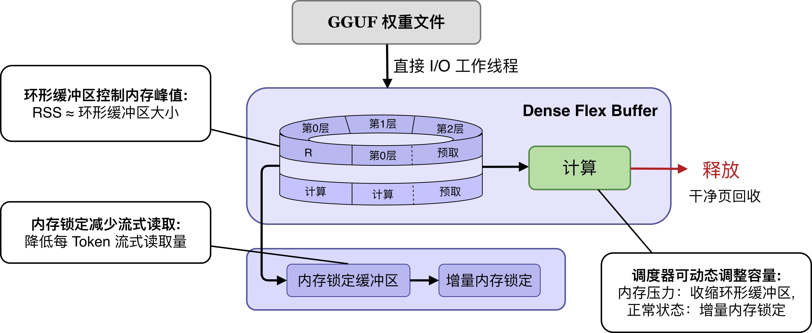

**作用：利用 Dense 模型固定的逐层访问规律，将完整权重访问转化为有限层工作集的驻留、读取与回收。**

主要机制包括：

- 层环形缓冲区；
- 后台权重读取；
- 权重驻留与风险感知锁定；
- 低价值权重清理回收；
- 自适应预取；
- 运行期工作集扩缩容。

通过主动维护当前计算附近的层工作集，Dense Flex 能够减少内存受限条件下反复从存储设备读取相同权重产生的 I/O 等待。

#### 2.6.2 MoE Buffer 模块


**作用：利用 MoE 专家的稀疏激活和访问局部性，将完整专家集合转化为有限大小的动态专家工作集。**

主要机制包括：

- 专家工作单元与按需切片加载；
- 活跃专家工作集估计；
- 专家访问热度统计；
- 专家预测与异步预取；
- 组级驱逐与压力感知保护；
- 专家缓存自动预算。

系统根据真实专家访问持续更新工作集，在有限内存中优先保留当前更可能产生复用收益的专家。

#### 2.6.3 KV Cache 弹性驻留模块

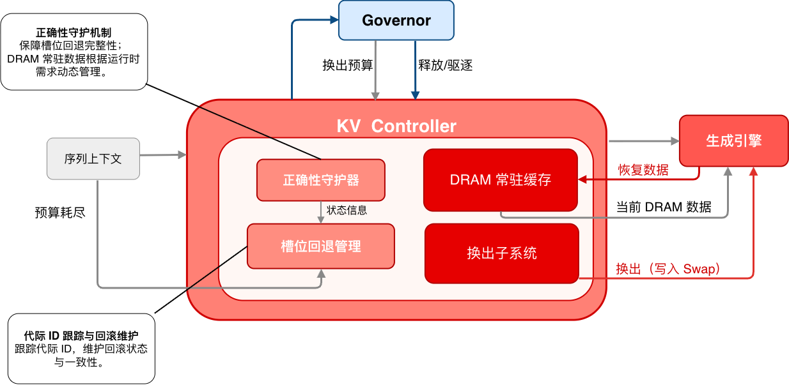

**作用：将 KV 的逻辑会话状态与物理驻留状态解耦，使暂时不需要的 KV 能够让出物理内存，并在会话重访前完整恢复。**

根据 KV 当前状态执行三类主要动作：

- **直接释放**：当前已经不用、后续也无需恢复的 KV 直接释放物理页；
- **按需换出**：当前暂不使用但后续仍可能需要的 KV 写入后备存储后释放物理内存；
- **精确恢复**：会话再次访问时先完整恢复所需 KV，确认恢复完成后再继续推理。

系统同时根据真实物理驻留量控制 KV 工作集大小，并通过连续传输、读取/恢复流水和目标页预缺页降低恢复阶段的数据搬运与等待开销。

#### 2.6.4 全局内存控制器（Server Memory Governor）

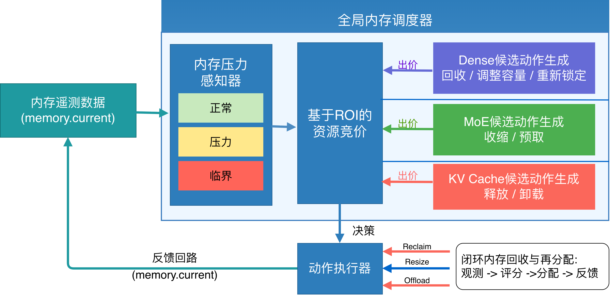

**作用：从全局视角协调 Dense、MoE、KV Cache 和预取资源，根据真实内存压力动态执行工作集调整与资源再分配。**

全局内存控制器主要完成：

- 压力感知：持续观测系统内存状态及各模块物理驻留；
- 动作控制：根据当前压力决定允许执行的驻留、回收和预取操作；
- 收益排序：综合可释放空间、访问价值与动作代价选择需要调整的工作集；
- 统一预取：限制 Dense 权重、MoE 专家和 KV 恢复同时产生的内存与 I/O 开销；
- 资源再分配：根据实际物理内存释放效果形成可重新利用的资源，并分配给当前更高价值的权重驻留、专家工作集或 KV Cache。

由此形成“状态观测—资源决策—动作执行—效果反馈—资源再分配”的运行时闭环，使三个专用内存管理模块能够在同一物理内存与 I/O 边界下协同运行。

---

## 三、项目目标及完成情况

### 3.1 目标完成情况

围绕赛题要求，FlexKV-OS 从**推理访存行为分析、运行时物理内存管理、I/O 延迟隐藏和全局资源协调**四个方向展开设计与实现。目前已完成从访问规律分析、差异化工作集管理到全局运行时治理的系统集成，并建立 Dense、MoE、KV Cache 及统一调度的实验验证体系。

| 目标 | 完成情况 | 主要完成内容 |
| --- | --- | --- |
| **目标 1：分析大模型推理访存行为** | 全部完成 | 完成 Dense 权重顺序访问、MoE 专家稀疏激活及 KV Cache 生命周期与物理驻留分析 |
| **目标 2：实现运行时内存管理** | 全部完成 | 实现 Dense 层工作集、MoE 专家工作集和 KV Cache 动态物理驻留管理 |
| **目标 3：实现预取与 I/O 重叠** | 全部完成 | 实现 Dense 权重预取、MoE 专家预测预取以及 KV 读取与恢复流水 |
| **目标 4：实现全局资源调度** | 全部完成 | 实现加载期内存规划、运行期压力感知、统一预取和物理内存动态再分配 |
| **总体完成度** | 全部完成 | 完成系统集成，并完成内存、性能与计算正确性验证 |

### 3.2 系统完成情况

FlexKV-OS 已形成“加载期规划 + 运行期治理”的完整运行时内存管理流程：

- Dense 权重：利用逐层访问规律维护有限层工作集，减少重复权重读取；
- MoE 专家：利用稀疏激活规律维护动态专家工作集，并根据内存压力调整专家预算；
- KV Cache：将会话逻辑状态与物理驻留解耦，实现直接释放、按需换出与精确恢复；
- 全局调度：统一协调三类工作集及其预取资源，根据真实内存压力动态回收和重新分配物理内存。

系统由此将原本主要依赖操作系统被动调页的运行方式，转变为利用模型结构和运行时状态主动管理工作集。

---

## 四、系统测试结果

### 4.1 测试环境

| 环境指标 | 环境参数 |
| --- | --- |
| **系统环境** | Ubuntu 22.04 / Linux 5.15.0+ / 物理机 |
| **硬件配置** | x86-64，8 核 / 23 GB 物理内存 |
| **存储设备** | SSD，顺序读速约 279 MB/s |
| **Dense 测试模型** | Llama-3-8B-Instruct-Q4_K_M.gguf（约 4.58 GB） |
| **MoE 测试模型** | Qwen1.5-MoE-A2.7B-20-experts-SFT-trained.Q4_K_M.gguf |
| **MoE 模型结构** | 24 层 MoE / 20 Experts / Top-4 激活 |
| **内存限制方式** | cgroup v2（memory.max / memory.high） |
| **测试工具** | llama-bench、llama-perplexity、Trace Replay、mincore |

测试重点关注真实物理内存占用、I/O 与推理性能、受限内存下的运行稳定性以及计算正确性。

### 4.2 Dense 权重管理测试

#### 4.2.1 消除冗余权重副本

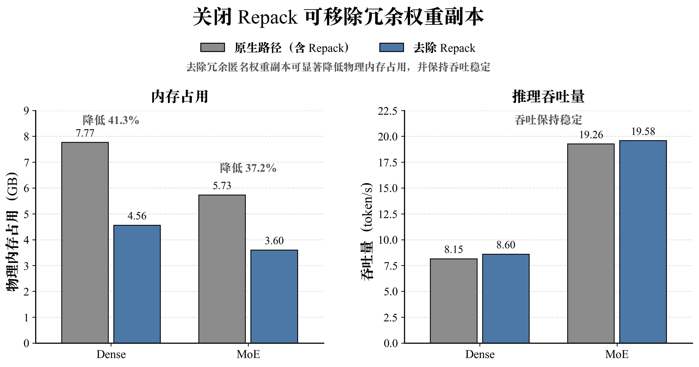

| 配置 | RSS | 吞吐 |
| --- | ---: | ---: |
| Dense 原生路径 | 7.77 GB | 8.15 tok/s |
| **Dense 去除 Repack** | **4.56 GB** | **8.60 tok/s** |
| MoE 原生路径 | 5.73 GB | 19.26 tok/s |
| **MoE 去除 Repack** | **3.60 GB** | **19.58 tok/s** |

去除 Repack（权重重排）产生的冗余副本后，Dense 和 MoE 的 RSS 分别降低 41.3% 和 37.2%，吞吐保持稳定。

#### 4.2.2 层工作集减少重复权重读取

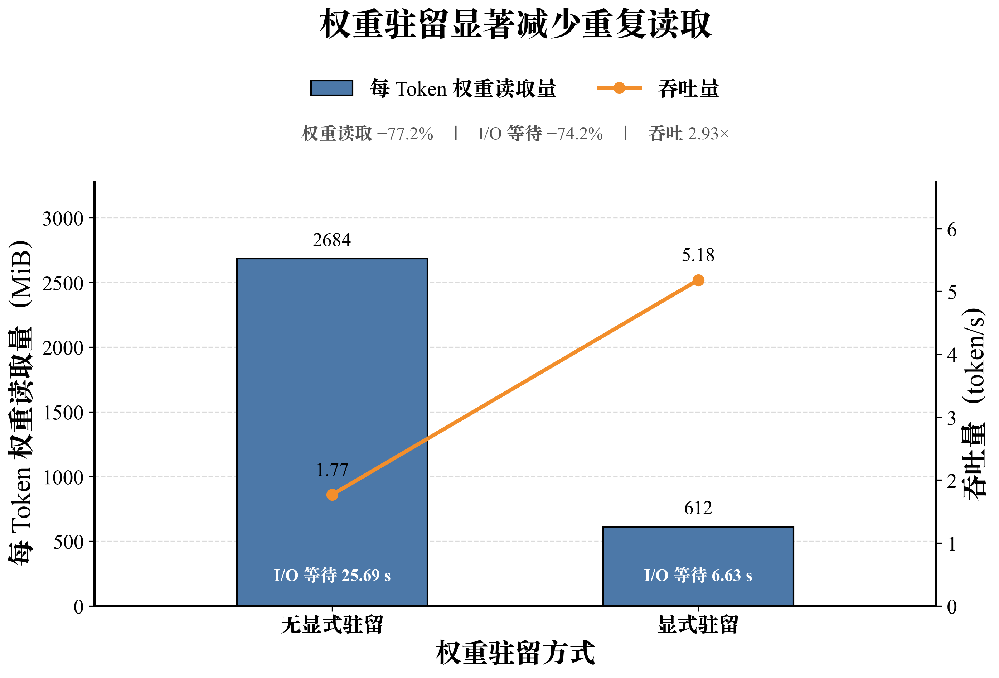

| 指标 | 无显式驻留 | 显式驻留 | 变化 |
| --- | ---: | ---: | ---: |
| 每 Token 权重读取量 | 2684 MiB | **612 MiB** | **-77.2%** |
| I/O 等待 | 25.69 s | **6.63 s** | **-74.2%** |
| 吞吐 | 1.77 tok/s | **5.18 tok/s** | **2.93×** |

有限层工作集显著减少重复权重读取和 I/O 等待，使受限内存下的推理吞吐提升至 2.93 倍。

#### 4.2.3 风险感知权重锁定

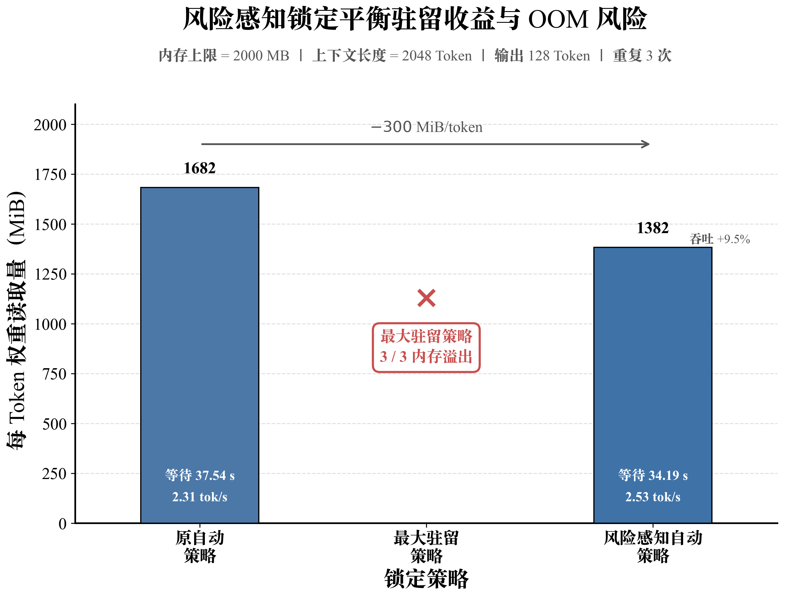

在 2000 MB 内存上限下，最大驻留策略 3/3 次发生内存溢出；风险感知策略稳定运行，并将每 Token 权重读取量由 1682 MiB 降至 1382 MiB。

### 4.3 MoE 专家工作集测试

#### 4.3.1 专家工作集边界

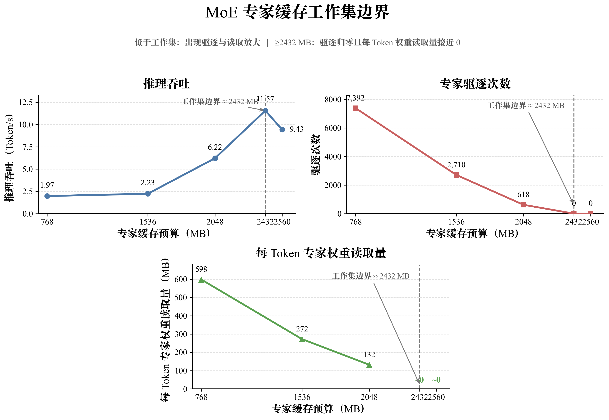

| 专家缓存预算 | 驱逐次数 | 每 Token 权重读取量 | 吞吐 |
| ---: | ---: | ---: | ---: |
| 768 MB | 7392 | 598 MiB | 1.97 tok/s |
| 1536 MB | 2710 | 272 MiB | 2.23 tok/s |
| 2048 MB | 618 | 132 MiB | 6.22 tok/s |
| **2432 MB** | **0** | **≈0** | **11.57 tok/s** |
| 2560 MB | 0 | ≈0 | 9.43 tok/s |

约 2432 MB 时缓存已覆盖当前负载下的主要活跃专家工作集，驱逐和额外专家读取基本消失。

#### 4.3.2 自动专家预算

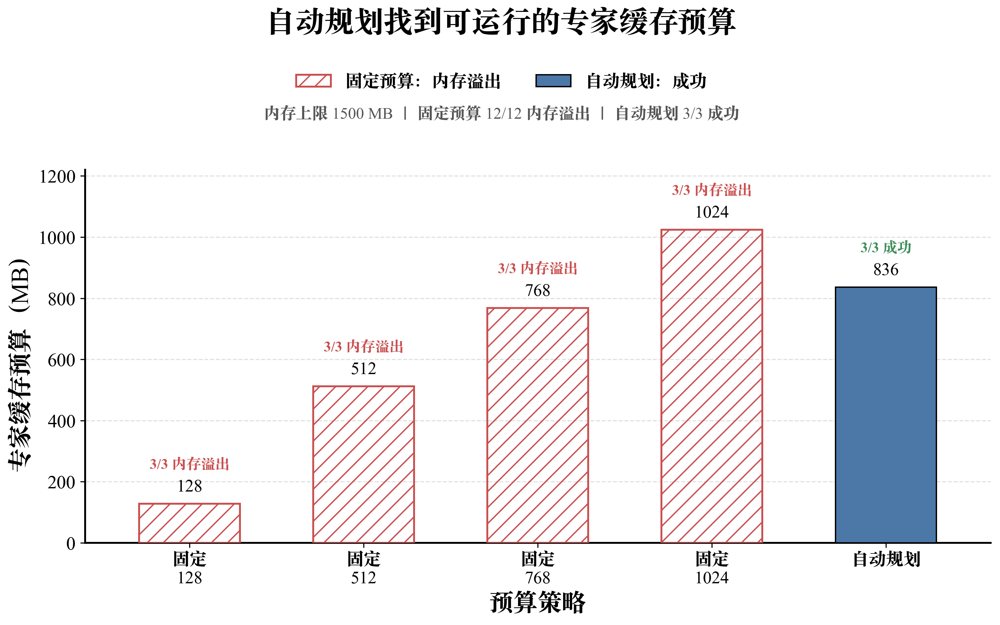

在 1500 MB 内存上限下：

| 策略 | 专家缓存预算 | 运行结果 |
| --- | ---: | --- |
| 固定 | 128 MB | 3/3 内存溢出 |
| 固定 | 512 MB | 3/3 内存溢出 |
| 固定 | 768 MB | 3/3 内存溢出 |
| 固定 | 1024 MB | 3/3 内存溢出 |
| **自动规划** | **836 MB** | **3/3 成功** |

自动预算综合专家工作集需求和整体内存边界，在 1500 MB 内存上限下实现稳定运行。

#### 4.3.3 压力感知专家调度

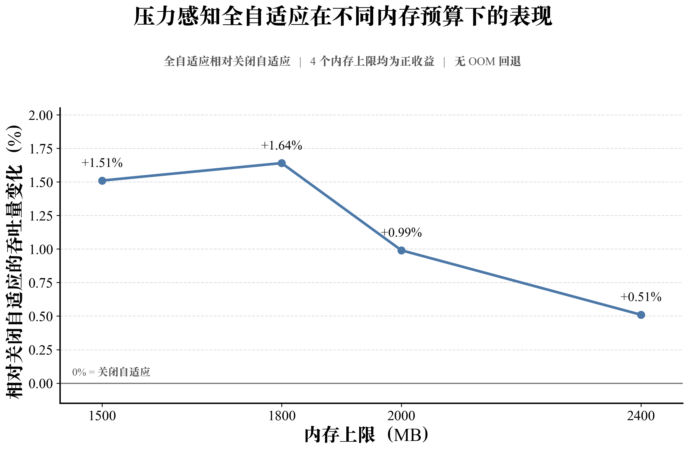

| 内存上限 | 相对关闭自适应策略的吞吐变化 |
| ---: | ---: |
| 1500 MB | **+1.51%** |
| 1800 MB | **+1.64%** |
| 2000 MB | **+0.99%** |
| 2400 MB | **+0.51%** |

根据实时内存压力动态调整专家保护范围后，四档内存限制下均保持正向吞吐收益。

#### 4.3.4 计算正确性

MoE Buffer 改变专家权重的加载与驻留方式，但真实 Router 仍决定最终参与计算的专家。WikiText-2 测试中，**4/4 数据块困惑度完全一致，最大 PPL 差值为 0**。

### 4.4 KV Cache 管理测试

#### 4.4.1 真实物理驻留与分层回收

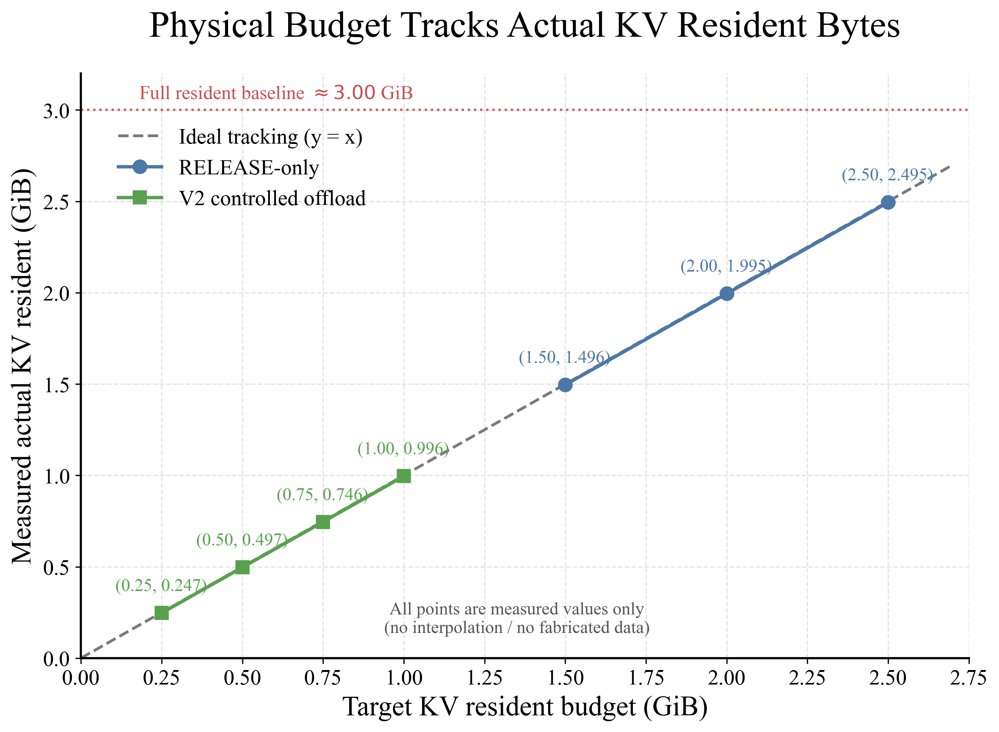

目标预算逐步收紧时，KV 实际物理驻留基本同步下降，说明系统能够直接控制真实物理工作集。

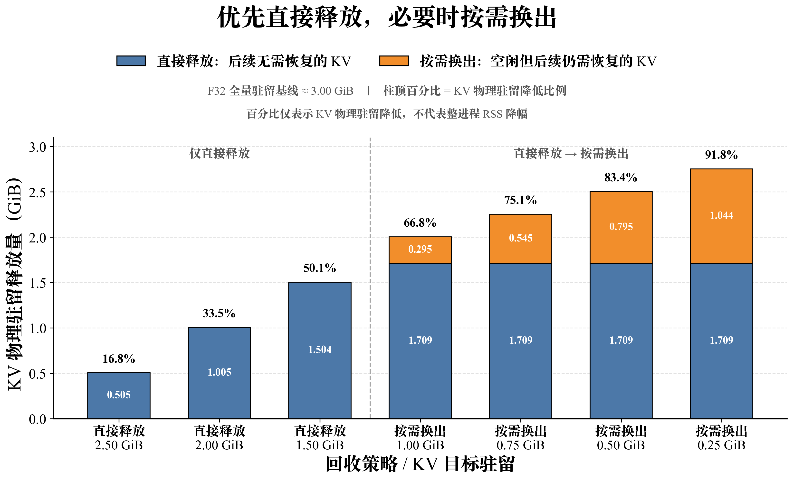

系统优先直接释放无恢复价值的 KV，只有继续收紧预算时才按需换出仍有会话价值的数据，从而减少不必要的数据迁移。

#### 4.4.2 物理驻留与会话恢复代价

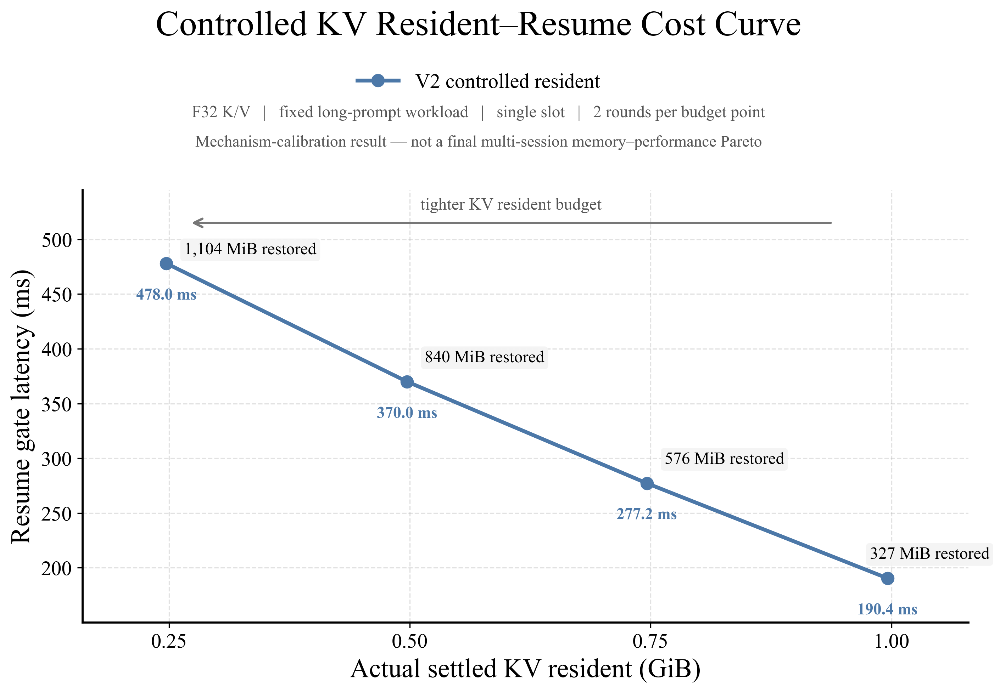

| KV 实际物理驻留 | 恢复数据量 | 会话恢复等待 |
| ---: | ---: | ---: |
| 0.996 GiB | 327 MiB | 190.4 ms |
| 0.746 GiB | 576 MiB | 277.2 ms |
| 0.497 GiB | 840 MiB | 370.0 ms |
| 0.247 GiB | 1104 MiB | 478.0 ms |

KV 驻留越低，会话重访时需要恢复的数据越多，因此系统需要在物理内存节省与恢复代价之间选择合适的驻留预算。

### 4.5 全局自动调度测试

#### 4.5.1 整体内存与吞吐

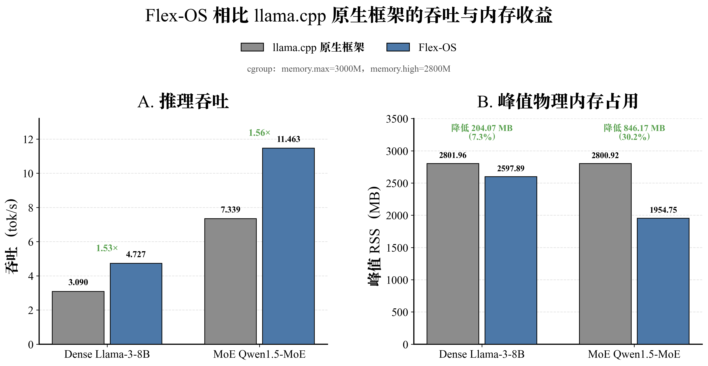

在相同 3000 MB / memory.high=2800 MB 配置下，combined_auto 相对原生 llama.cpp baseline 同时降低峰值 RSS 并提高推理吞吐：

| 模型 | baseline 峰值 RSS | combined_auto 峰值 RSS | RSS 变化 | baseline 吞吐 | combined_auto 吞吐 | 吞吐变化 |
| --- | ---: | ---: | ---: | ---: | ---: | ---: |
| **Dense** | 2801.96 MB | **2597.89 MB** | **-204.07 MB（-7.28%）** | 3.090 tok/s | **4.727 tok/s** | **+52.97%（1.53×）** |
| **MoE** | 2800.92 MB | **1954.75 MB** | **-846.17 MB（-30.21%）** | 7.339 tok/s | **11.463 tok/s** | **+56.19%（1.56×）** |

统一自动调度下，Dense 与 MoE 均实现峰值物理内存下降和推理吞吐提升，其中 MoE 的 RSS 降低 30.21%、吞吐提升 56.19%。

#### 4.5.2 MoE 容量边界

| 策略 | 最低成功配置 | 最低成功 memory.high |
| --- | --- | ---: |
| 原生 llama.cpp | 3000 MB | 2800 MB |
| **weight_only** | **1500 MB** | **1300 MB** |
| **combined_auto** | **1500 MB** | **1300 MB** |

权重管理与统一自动调度均将 MoE 最低可运行 memory.high 从 2800 MB 下移至 1300 MB，并在 7 个内存压力点中成功运行 6 个。

#### 4.5.3 压力驱动的动态资源调整

**MoE：** 1500 MB 限制下专家预算约为 768 MB；随着内存压力缓解，3000 MB 配置下专家驻留工作集扩大至约 1500 MB，驱逐降为 0，吞吐达到 11.46 tok/s。

**Dense：** 全局内存控制器根据内存压力和工作集收益调整权重驻留，并结合 KV 空间回收为层工作集腾挪物理内存；3000 MB 配置下每 Token 权重流式读取量约为 554.5 MiB。

#### 4.5.4 计算一致性

Dense 的统一自动调度路径与对照路径保持相同输出哈希；MoE 的统一自动调度路径与仅权重管理路径同样保持相同输出哈希，测试过程中未出现内存溢出或系统强制终止。

---

## 五、文件索引

### 5.1 演示与文档入口

| 类型 | 说明 | 路径 |
| --- | --- | --- |
| **项目演示视频** | 展示系统在受限内存环境下的运行过程和主要效果 | [查看演示视频](https://pan.baidu.com/s/1kRGYhIfbl4PLiyhwmMc7eA?pwd=6rxu) |
| **演示测试脚本** | 对比原生 llama.cpp 与 Flex-OS 统一调度效果 | [`scripts/demo-global-compare.sh`](./scripts/demo-global-compare.sh) |
| **设计开发文档** | 项目完整设计、实现与测试说明 | [查看参赛文档](./docs/参赛文档.pdf) |
| **参赛演示文档** | 项目决赛答辩展示材料 | [查看演示文档](./docs/操作系统功能赛.pptx) |

演示视频对应的 Dense / MoE 测试可通过以下指令执行：

```bash
# Dense
DROP_CACHES_BEFORE_BASELINE=1 PREWARM_CACHE_BEFORE_COMBINED=1 README_COMPAT=1 \
scripts/demo-global-compare.sh dense

# MoE
DROP_CACHES_BEFORE_BASELINE=1 PREWARM_CACHE_BEFORE_COMBINED=1 README_COMPAT=1 \
scripts/demo-global-compare.sh moe
```

### 5.2 核心源码入口

| 模块 | 核心文件 | 主要职责 |
| --- | --- | --- |
| **加载期内存规划** | `src/llama-model.cpp` | 识别模型结构与内存约束，选择 Dense / MoE 管理路径并生成初始资源配置 |
| **Dense 权重管理** | `src/llama-flex.cpp` | 层工作集、权重流式读取、显式驻留、清理回收、自适应预取与工作集调整 |
| **MoE 专家管理** | `src/llama-moe-buffer.cpp` | 专家工作集、专家预测与预取、驱逐与保护、动态专家预算 |
| **推理运行时接入** | `src/llama-context.cpp` | 将 Dense / MoE 权重管理接入模型推理执行路径 |
| **KV Cache 生命周期管理** | `src/llama-kv-cache.cpp`、`src/llama-kv-cache-action.h` | KV 生命周期、物理驻留、直接释放、按需换出与精确恢复 |
| **KV Cache 运行时控制** | `tools/server/server-kv-pressure-action.cpp`、`tools/server/server-kv-resume.cpp` | KV 物理驻留预算、压力动作、会话重访与恢复 |
| **全局内存控制** | `tools/server/server-context.cpp` | 内存压力观测、资源决策、统一预取与跨模块资源再分配 |

---

## 六、项目亮点

FlexKV-OS 的核心创新点可以概括为：

- **风险感知权重锁定**：综合权重驻留收益与内存风险选择性锁定高收益权重，减少重复 I/O，同时避免过度驻留导致内存溢出；
- **专家激活预测**：利用专家访问规律预测后续高概率激活专家并提前加载，减少 MoE 专家缺页等待；
- **专家工作集估计**：根据专家访问收益与工作集覆盖率动态分配缓存预算，使有限内存优先用于高价值专家；
- **代价感知 KV 回收**：综合物理内存收益、复用价值与恢复代价选择 KV 回收对象，并将释放的物理内存重新用于高收益工作集；
- **分组流水恢复**：将 KV 读取、恢复和后续数据准备组成流水，在降低物理驻留的同时控制会话恢复延迟；
- **自适应预取窗口**：根据内存压力、I/O 状态和运行进度动态调整预取范围，兼顾内存占用与数据准备效率。

在此基础上，系统通过**加载期资源规划与运行期全局调度**统一协调 Dense 权重、MoE 专家、KV Cache 和预取资源，实现从操作系统被动调页向模型结构感知、内存压力感知和访问代价感知的主动内存治理。