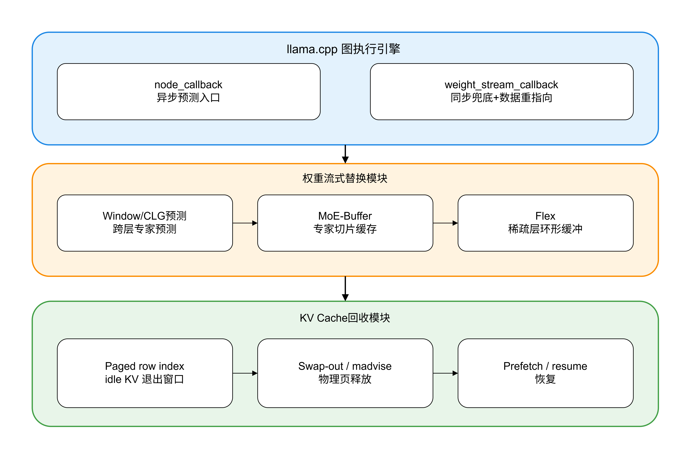
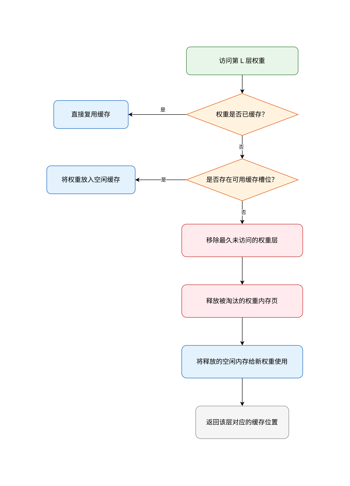
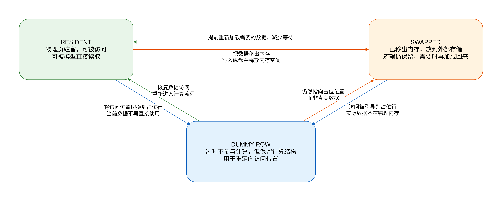
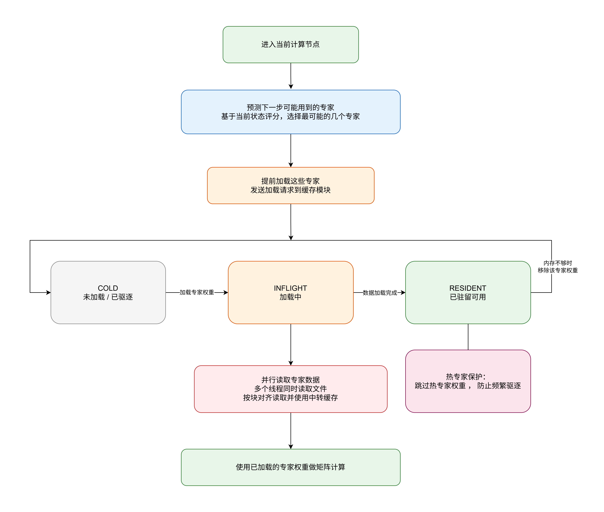
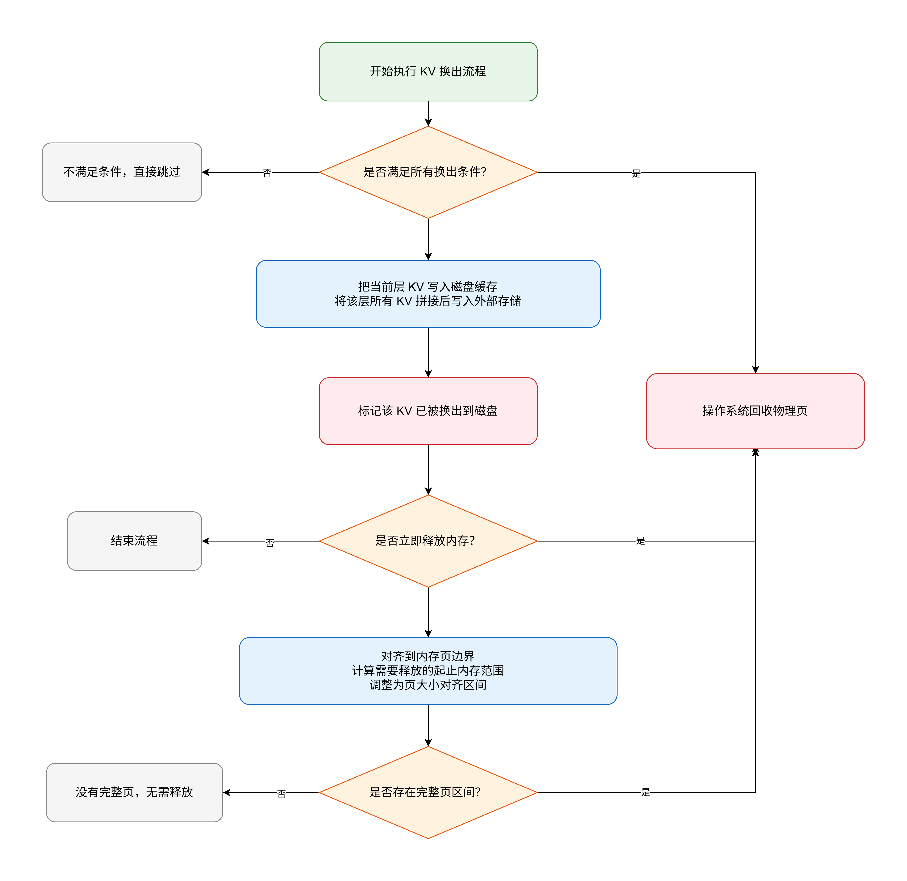

# FlexKV-OS（Flexible Weight-KV Runtime Memory System）


## 一、基本信息

### 1.1 队伍介绍

|    项目    | 内容                                     |
| :------: | :------------------------------------- |
| **项目名称** | FlexKV-OS：面向内存受限 LLM 推理的权重–KV 协同流式内存系统 |
| **基础框架** | llama.cpp / ggml                       |
| **优化方向** | LLM 推理运行时内存优化、权重流式管理、KV Cache 物理页回收    |
| **适用场景** | 边缘设备、本地低内存环境、长上下文多会话推理                 |
| **小组成员** | 苏安炫、李思甜                                |
| **项目导师** | 夏文 李诗逸                                    |
| **仓库地址** | https://gitlab.eduxiji.net/T2026181239911430/project3136859-389161                                    |
| **参赛文档** | `docs/参赛文档.pdf`                        |

### 1.2 摘要

随着大语言模型参数规模和上下文长度持续增长，LLM 推理对物理内存的需求迅速上升。对于边缘设备、嵌入式设备和本地低内存环境而言，完整加载模型权重和长期保留 KV Cache 往往会导致 RSS 过高、同步缺页频繁、推理吞吐下降，甚至直接触发 OOM。原生 `llama.cpp` 主要依赖 `mmap` 和操作系统 page cache 管理模型权重，虽然实现简单，但在内存压力下缺乏应用层可控的驻留与回收策略；同时，KV Cache 作为运行时动态状态，会随着上下文长度和 session 数增加持续膨胀，尤其在 idle/resume 多会话场景中，历史 KV 长期占据物理页。

针对上述问题，本项目提出 **FlexKV-OS**，一个基于 `llama.cpp` 的运行时内存优化系统。系统将模型权重和 KV Cache 统一视为可调度的运行时内存对象：在权重侧，针对 Dense 模型设计 layer-level Dense Flex Buffer，针对 MoE 模型设计 expert-level MoE-Buffer，并结合 CLG expert prefetch 实现预测驱动的异步加载；在 KV Cache 侧，设计 Paged-KV Reclaim，将 KV Cache 的逻辑上下文状态与物理驻留状态解耦，对 idle-owned 且 active-invisible 的 KV block 执行 swap-out，并通过 `madvise(MADV_DONTNEED)` 释放物理页。

实验结果表明，FlexKV-OS 能够在不修改模型权重、不改变推理语义、不截断上下文的前提下降低运行时 RSS。权重侧优化能够显著减少 repack 和全量驻留带来的冗余内存；Paged-KV Reclaim 在 ctx4096 和 ctx8192 多 session trace replay 中分别降低约 611.883 MiB 和 1619.195 MiB RSS；权重侧 Flex 与 KV Cache reclaim 组合后，RSS 从 8,683,152 KB 降至 4,703,812 KB，总体下降约 45.83%，同时 active TPS 保持接近原始路径。

### 1.3 主要工作

* **构建了面向 LLM 推理的运行时内存调度框架**
  在 `llama.cpp` / `ggml` 中引入轻量 hook，将推理执行层、权重管理模块和 KV Cache 管理模块连接起来，使模型权重和 KV Cache 能够在运行时被显式加载、替换、换出和恢复。

* **实现了 Dense 模型的 layer-level Flex Buffer**
  针对 Dense 模型每个 token 都需要访问全部层权重的特点，系统以 decoder layer 为基本单位维护匿名 ring slot，通过 LRU 替换和自适应 ring size 控制权重工作集，避免原生 mmap 在内存受限场景下发生不可控驻留或 OOM。

* **实现了 MoE 模型的 expert-level MoE-Buffer**
  针对 MoE 模型专家稀疏激活特征，系统以 expert slice 为粒度维护 `COLD / INFLIGHT / RESIDENT` 三态缓存，并结合后台 worker、LRU 驱逐和 hot expert 保护，在有限内存中保留高频活跃 expert。

* **设计了 CLG expert prefetch 机制**
  系统在图节点完成后获取当前 hidden state，预测下一层可能激活的 Top-K + delta expert，并提前提交给 MoE-Buffer worker 异步加载。预测路径只影响性能，实际 kernel 前仍由 `weight stream callback` 做同步兜底，从而保证正确性。

* **实现了 Paged-KV Reclaim 运行时回收机制**
  系统将 KV Cache 划分为 block，维护 owner、resident/swapped、active visibility、resume protection 等状态。对于 idle-owned 且 active-invisible 的 block，系统先写入 backing store，再调用 `madvise(MADV_DONTNEED)` 释放原 KV tensor 物理页，并在 session resume 时按需恢复。

* **提供了可验证的内存收益诊断路径**
  除进程级 RSS 外，系统引入 `mincore` 对 KV tensor 地址范围进行 resident page 采样，证明 RSS 下降主要来自 KV resident pages 的真实减少，而不是其他内存波动。

---

## 二、项目概述

### 2.1 背景和意义

大语言模型推理通常包含两个主要阶段：Prefill 阶段和 Decode 阶段。Prefill 阶段需要处理完整输入序列，Decode 阶段则逐 token 自回归生成。在 Decode 阶段，每生成一个 token 都需要访问模型权重，并读取历史 KV Cache。随着模型参数量、上下文长度和并发 session 数增加，权重 I/O 与 KV Cache I/O 逐渐成为推理系统的核心瓶颈。

在资源充足的服务器环境中，可以依靠大内存、大显存和高带宽存储缓解这些问题。但在边缘设备、本地 CPU 推理和低内存机器上，LLM 推理面临更严格的资源约束：

* 模型权重无法完整常驻物理内存；
* 存储带宽远低于内存带宽；
* page fault 和同步 I/O 会直接阻塞推理线程；
* KV Cache 随上下文长度线性增长；
* idle session 的历史 KV 虽暂时不用，但仍长期占据物理页；
* 原生 `mmap` 与 page cache 行为不可控，难以根据模型访存特征主动调度。

因此，LLM 推理系统需要从“静态加载模型”转向“运行时管理工作集”。FlexKV-OS 正是围绕这一目标设计：将模型权重和 KV Cache 从被动驻留对象转化为可调度、可回收、可恢复的运行时资源。

### 2.2 当前任务主要痛点

#### 2.2.1 权重驻留不可控

原生 `llama.cpp` 依赖 `mmap` 加载模型权重，由内核在访问时触发缺页调入。这种方式在内存充足时效果较好，但在内存紧张时，应用层难以控制哪些权重应当保留、哪些权重可以释放。当 repack 或 extra buffer 存在时，还会产生额外匿名副本，导致文件页与重排后的匿名页重复驻留。

#### 2.2.2 Dense 与 MoE 模型访存模式差异明显

Dense 模型每个 token 都会访问全部层权重，优化重点是控制 layer-level working set；MoE 模型每个 token 只激活少量 expert，优化重点是利用 expert 稀疏性进行细粒度缓存。如果使用统一策略处理 Dense 和 MoE，会忽略模型结构差异，难以同时兼顾性能和内存收益。

#### 2.2.3 KV Cache 动态增长且难以安全释放

KV Cache 是推理运行时产生的状态，不能像只读权重一样简单丢弃。历史 KV 未来可能被 resume session 再次访问，因此系统必须保证上下文逻辑不变。原生连续 KV buffer 难以区分“逻辑上需要保留”和“当前物理上必须驻留”，导致 idle session 的 KV 长期占据 RSS。

#### 2.2.4 内存优化需要兼顾正确性和可验证性

LLM 推理系统不能为了节省内存改变模型输出。权重流式、expert 预取、KV swap-out 都必须在不破坏数值语义和 attention 语义的前提下进行。同时，比赛场景不仅需要展示 RSS 降低，还要证明内存下降来自真实物理页回收，而不是测试噪声。

### 2.3 项目介绍及动机

FlexKV-OS 的设计动机来自 LLM 推理访存模式的两个观察。

第一，LLM 权重访问具有高度结构性。Dense 模型按照 layer 顺序执行，MoE 模型虽然存在路由选择，但 expert 激活具有稀疏性和局部性。因此，系统可以根据模型结构提前判断未来可能访问的数据，并将被动缺页转化为主动调度。

第二，KV Cache 的逻辑生命周期和物理驻留状态并不等价。某些 idle session 的历史 KV 在逻辑上仍需保留，但当前 active request 不会读取它们。只要系统能记录其 backing store 位置，并在 resume 前恢复，就可以释放这些 block 对应的物理页。

基于上述动机，FlexKV-OS 采用“双路径协同”的整体方案：

* 权重侧：根据模型结构分别采用 Dense Flex Buffer 和 MoE-Buffer，控制模型参数的物理驻留；
* KV 侧：根据 session 状态和 attention 可见性，对 idle KV block 执行安全换出；
* 调度侧：通过 node callback 和 weight stream callback 接入 llama.cpp 执行过程，实现异步预取与同步兜底；
* 验证侧：通过 RSS、TPS、perplexity、trace replay 和 mincore 共同验证内存收益与正确性。

### 2.4 整体架构



FlexKV-OS 整体分为三层：

* **推理执行层**：负责 Transformer layer、MoE router、attention 和 GGML CPU kernel 的执行；
* **运行时内存调度层**：负责 Dense Flex、MoE-Buffer、CLG expert prefetch 和 Paged-KV Reclaim；
* **操作系统与存储层**：提供 `mmap`、`pread`、`O_DIRECT`、`madvise`、`mincore` 等底层机制。


### 2.5 整体流程


系统运行流程可以概括为：

1. 模型加载阶段注册权重 tensor、layer 信息、expert slice 信息和 KV Cache metadata；
2. 推理执行阶段通过 node callback 捕获 layer 执行进度；
3. CLG 根据 hidden state 预测下一层 expert，并提交异步预取；
4. CPU kernel 执行前通过 weight stream callback 检查权重是否 resident；
5. Dense Flex 或 MoE-Buffer 在必要时执行同步兜底加载；
6. KV Cache 模块根据 session idle/resume 状态识别可换出的 KV block；
7. 对 idle-owned 且 active-invisible 的 block 写入 backing store；
8. 调用 `madvise(MADV_DONTNEED)` 释放对应 KV 物理页；
9. session resume 时按需 swap-in，并通过 prefetch 降低首 token 延迟；
10. 通过 RSS、TPS、mincore 和 trace replay 验证系统效果。

### 2.6 核心技术与模块架构

#### 2.6.1 Dense Flex Buffer 模块



**优势：将 Dense 模型权重从全量 mmap 驻留转化为 layer-level 工作集控制，在内存受限场景下提供确定性驻留边界。**

该模块主要包含：

* layer tensor 注册；
* ring slot 管理；
* LRU layer 替换；
* `O_DIRECT` / buffered read；
* adaptive ring size；
* `weight stream callback` 同步兜底。

#### 2.6.2 MoE-Buffer 模块



**优势：利用 MoE expert 稀疏激活特征，只保留当前 workload 下的活跃 expert，并将冷 expert 转化为可按需换入的状态。**

该模块主要包含：

* expert slice 注册；
* `COLD / INFLIGHT / RESIDENT` 三态状态机；
* 后台 worker 预取；
* LRU 驱逐；
* hot expert 保护；
* budget 控制；
* expert data 指针重定向。

#### 2.6.3 CLG Expert Prefetch 模块



**优势：基于当前 hidden state 预测下一层 expert，将同步 I/O 尽可能提前到后台执行，提高 I/O 与计算重叠。**

该模块主要包含：

* node callback；
* hidden state 读取；
* expert score 计算；
* Top-K + delta 选择；
* MoE-Buffer prefetch task 提交。

CLG 只负责性能优化，不改变真实 routing。预测失败时由 `weight stream callback` 做同步兜底。

#### 2.6.4 Paged-KV Reclaim 模块



**优势：将 KV Cache 的逻辑上下文状态与物理驻留状态解耦，使 idle session 历史 KV 在不截断上下文的前提下释放物理页。**

该模块主要包含：

* block-level KV metadata；
* owner / visibility 状态维护；
* paged row index；
* idle block swap-out；
* backing store；
* `madvise(MADV_DONTNEED)`；
* resume swap-in；
* resume-aware prefetch；
* fast maintenance；
* `mincore` resident page 诊断。


---

## 三、项目目标及完成情况

项目实现目标如下：

| 实现内容               | 完成情况 | 说明                                                                 |
| ------------------ | ---- | ------------------------------------------------------------------ |
| 目标 1：分析 LLM 推理访存行为 | 全部完成 | 分析权重逐层访问、MoE expert 稀疏激活和 KV Cache 随上下文增长的规律                       |
| 目标 2：降低运行时物理内存占用   | 全部完成 | 实现 Dense Flex、MoE-Buffer 和 Paged-KV Reclaim，降低权重和 KV Cache RSS     |
| 目标 3：通过预取隐藏 I/O 延迟 | 全部完成 | 实现 CLG expert prefetch、多 worker 预取和 resume-aware KV prefetch       |
| 目标 4：保证推理语义不变      | 全部完成 | 通过同步兜底、先保存后释放、perplexity 对比和 trace replay 保证正确性                    |
| 目标 5：构建可复现实验与诊断工具  | 全部完成 | 支持 llama-bench、llama-perplexity、llama-kv-trace-replay 和 mincore 诊断 |

初赛实现内容及时间节点如下：

| 实现内容  | 时间      | 说明                                                                   |
| ----- | ------- | -------------------------------------------------------------------- |
| 行动项 1 | 第 1–2 周 | 调研 llama.cpp、GGUF、mmap、KV Cache 管理机制和相关 LLM 推理内存优化工作                 |
| 行动项 2 | 第 3 周   | 搭建 Ubuntu / llama.cpp 开发环境，完成 baseline 编译与测试                         |
| 行动项 3 | 第 4–5 周 | 实现权重侧基础流式管理，包括 Dense layer 注册和 MoE expert slice 管理                   |
| 行动项 4 | 第 6 周   | 实现 MoE-Buffer 三态状态机、多 worker 加载、LRU 驱逐和 hot expert 保护                |
| 行动项 5 | 第 7 周   | 实现 CLG expert prefetch，打通 node callback 与 MoE-Buffer 预取路径            |
| 行动项 6 | 第 8 周   | 实现 Paged-KV metadata、swap-out / swap-in、paged row index 与 madvise 回收 |
| 行动项 7 | 第 9 周   | 完成 trace replay、mincore 诊断、权重侧和 KV 侧组合测试                             |
| 行动项 8 | 第 10 周  | 完成文档整理、README 编写、测试结果汇总与参赛材料准备                                       |

后续优化方向：

* 支持 GPU backend 下的 device-memory KV reclaim；
* 将 KV prefetch 从 driver 协作式进一步扩展为独立后台 worker；
* 支持更细粒度的 block-level Dense 权重流式管理；
* 引入更智能的 expert / layer 预测策略；
* 支持更多模型结构和更大规模模型；
* 进一步优化权重侧与 KV 侧共享 I/O 带宽调度。

---

## 四、分析测试结果

### 4.1 测试环境

| 项目         | 配置                                                       |
| ---------- | -------------------------------------------------------- |
| 操作系统       | Ubuntu 22.04                                             |
| Linux 内核   | 5.15.0+                                                  |
| 机器类型       | 物理机                                                      |
| 内存         | 23GB                                                     |
| CPU        | x86-64，8 核                                               |
| 存储         | SSD，顺序读速约 279MB/s                                        |
| Dense 测试模型 | Llama-3-8B-Instruct-Q4_K_M.gguf                          |
| Dense 模型大小 | 约 4.58GB                                                 |
| MoE 测试模型   | Qwen1.5-MoE-A2.7B-20-experts-SFT-trained.Q4_K_M.gguf     |
| MoE 模型结构   | 24 个 MoE layer，每层 20 个 expert，top-4 激活                   |
| 内存限制方式     | cgroup v2 `memory.max`                                   |
| 测试工具       | `llama-bench`、`llama-perplexity`、`llama-kv-trace-replay` |

### 4.2 权重管理模块测试结果

#### 4.2.1 关闭 repack 的内存收益

| 配置                    |     RSS |          吞吐 |
| --------------------- | ------: | ----------: |
| Dense native，含 repack | 7.77 GB |  8.15 tok/s |
| Dense，关闭 repack       | 4.56 GB |  8.60 tok/s |
| MoE native，含 repack   | 5.73 GB | 19.26 tok/s |
| MoE，关闭 repack         | 3.60 GB | 19.58 tok/s |

结果表明，repack 会引入额外匿名权重副本。关闭 repack 后，Dense 模型 RSS 从 7.77 GB 降至 4.56 GB，MoE 模型 RSS 从 5.73 GB 降至 3.60 GB，同时吞吐未下降。

#### 4.2.2 Dense Flex / Window 路径

| 配置             |       RSS |         吞吐 | 说明                      |
| -------------- | --------: | ---------: | ----------------------- |
| native         |   7770 MB | 8.15 tok/s | 全量 page fault 驻留        |
| window / flex  |   4560 MB | 8.60 tok/s | 仅窗口层或受控工作集常驻            |
| 3GB cgroup cap | 约 4.26 GB | 0.40 tok/s | 避免 OOM，但进入 I/O-bound 状态 |

Dense 路径能够在内存相对充足时压缩 RSS，并保持接近原生路径的吞吐。在极端内存限制下，系统可以将 native OOM 转化为可运行状态，但由于 Dense 模型每个 token 都需要访问全部层权重，吞吐会受 SSD I/O 限制明显下降。

### 4.3 MoE-Buffer 测试结果

#### 4.3.1 MoE-Buffer 工作集边界

|  Budget | Evictions | Read / token |          吞吐 |
| ------: | --------: | -----------: | ----------: |
|  768 MB |      7392 |          598 |  1.97 tok/s |
| 1536 MB |      2710 |          272 |  2.23 tok/s |
| 2048 MB |       618 |          132 |  6.22 tok/s |
| 2432 MB |         0 |          约 0 | 11.57 tok/s |
| 2560 MB |         0 |          约 0 |  9.43 tok/s |

MoE-Buffer 存在明显工作集边界。当 budget 较小时，expert 在 `COLD / INFLIGHT / RESIDENT` 之间频繁切换，系统处于 I/O 抖动状态。当 budget 提升至约 2432 MB 后，evictions 降为 0，read/token 接近 0，说明缓冲区已经覆盖当前 workload 下的有效 expert 工作集。

#### 4.3.2 CLG 预测与预取效果

| Delta |     RSS | 命中率 |          吞吐 |
| ----: | ------: | --: | ----------: |
|     0 | 2411 MB | 94% | 12.52 tok/s |
|     4 | 2579 MB | 93% | 16.48 tok/s |
|     8 | 2634 MB | 93% | 17.27 tok/s |

适度增加 delta 会带来少量 RSS 增长，但可以扩大预取 expert 集合，增加 I/O 与计算之间的重叠时间，从而显著提升 MoE 路径吞吐。

#### 4.3.3 MoE 多 worker I/O 加速

|  Budget | 1 worker | 4 worker |  加速比 |
| ------: | -------: | -------: | ---: |
|  512 MB |     1.58 |     2.87 | 1.8x |
|  768 MB |     1.97 |     3.75 | 1.9x |
| 1536 MB |     2.23 |     5.42 | 2.4x |

在 MoE-Buffer 处于 I/O 主导区间时，多 worker 并行读取能够提升 expert 预取速度，减少计算线程等待 `INFLIGHT` expert 的时间。

#### 4.3.4 极端内存约束鲁棒性

| 模型 / 配置             |     RSS |         吞吐 | 结果           |
| ------------------- | ------: | ---------: | ------------ |
| Dense native        |       - |          - | OOM          |
| Dense Window / Flex | 4.26 GB | 0.40 tok/s | I/O-bound 运行 |
| MoE-Buffer          | 1.90 GB | 2.57 tok/s | 稳定运行         |

结果表明，FlexKV-OS 可以在极端内存约束下将原生路径的 OOM 转化为可运行状态。MoE 模型由于具有 expert 稀疏激活特征，在受限内存下比 Dense 模型更容易维持稳定吞吐。

### 4.4 KV Cache 回收测试结果

#### 4.4.1 ctx4096 trace replay

| 指标                              |      Baseline |      Paged-KV |           变化 |
| ------------------------------- | ------------: | ------------: | -----------: |
| Process RSS                     | 9,333,632 KiB | 8,707,064 KiB | -611.883 MiB |
| Active TPS                      |     10.875037 |     10.548073 |      -3.007% |
| Active decode time              | 77,976.745 ms | 80,393.828 ms |      +3.100% |
| Resume first-token weighted avg |    100.251 ms |    101.493 ms |    +1.242 ms |

在 ctx4096 多 session idle/resume 场景中，Paged-KV Reclaim 释放约 612 MiB RSS，active TPS 回退约 3%，resume first-token latency 增量约 1.2 ms。

#### 4.4.2 ctx8192 trace replay

| 指标                              |       Baseline |      Paged-KV |            变化 |
| ------------------------------- | -------------: | ------------: | ------------: |
| Process RSS                     | 10,364,540 KiB | 8,706,484 KiB | -1619.195 MiB |
| Active TPS                      |      10.846081 |     10.736931 |       -1.006% |
| Active decode time              |  78,184.923 ms | 78,979.742 ms |       +1.017% |
| Total wall time                 |  96,365.403 ms | 97,296.760 ms |       +0.966% |
| Resume first-token weighted avg |     103.225 ms |    100.830 ms |     -2.395 ms |

在 ctx8192 场景下，KV Cache 占总内存比例更高，因此 Paged-KV Reclaim 的收益更明显。系统释放约 1.58 GiB RSS，而 active TPS 仅下降约 1%。

#### 4.4.3 mincore resident page 诊断

ctx4096：

| 指标                | Baseline-like |    Paged-KV |            变化 |
| ----------------- | ------------: | ----------: | ------------: |
| KV total          |   1023.75 MiB | 1023.75 MiB |             0 |
| KV resident       |   1023.75 MiB |   426.0 MiB |   -597.75 MiB |
| KV resident ratio |        100.0% |      41.61% |       -58.39% |
| Process RSS drop  |             - |           - | 约 611.746 MiB |

ctx8192：

| 指标                | Baseline-like |    Paged-KV |             变化 |
| ----------------- | ------------: | ----------: | -------------: |
| KV total          |   2047.75 MiB | 2047.75 MiB |              0 |
| KV resident       |   2047.75 MiB |   426.0 MiB |   -1621.75 MiB |
| KV resident ratio |        100.0% |      20.80% |        -79.20% |
| Process RSS drop  |             - |           - | 约 1619.168 MiB |

`mincore` 结果表明，RSS 下降主要来自 KV tensor resident pages 的真实减少，而不是进程其他内存波动。

### 4.5 权重侧与 KV Cache 组合优化

| 配置             |          RSS | Active TPS | KV swap-out |
| -------------- | -----------: | ---------: | ----------: |
| default        | 8,683,152 KB |     14.593 |           0 |
| flex auto      | 5,134,680 KB |     14.749 |           0 |
| KV-only        | 8,250,536 KB |     14.143 |          23 |
| KV + flex auto | 4,703,812 KB |     14.171 |          23 |

Flex auto 与 KV Cache reclaim 作用于不同内存来源：前者降低模型权重驻留压力，后者释放 idle KV block 对应物理页。组合后 RSS 从 8,683,152 KB 降至 4,703,812 KB，整体下降约 45.83%，同时 active TPS 仍保持接近原始路径。

---

## 五、功能展示


链接：https://pan.quark.cn/s/3aa676ba1a33


## 六、文档信息

* [参赛文档](./docs/参赛文档.pdf)
* [参赛演示文档](./docs/操作系统设计赛.pptx)

---

## 七、目录索引

```shell
.
├── CMakeLists.txt
├── README.md
├── LICENSE
├── docs
│   ├── 参赛文档.pdf
│   └── reproduce_kv_cache_optimization.md
├── pics
│   ├── flexkv_architecture.png
│   ├── flexkv_workflow.png
│   ├── dense_flex.png
│   ├── moe_buffer.png
│   ├── clg_prefetch.png
│   ├── paged_kv.png
│   └── demo.png
├── src
│   ├── llama-flex.h
│   ├── llama-flex.cpp
│   ├── llama-moe-buffer.h
│   ├── llama-moe-buffer.cpp
│   ├── llama-window.h
│   ├── llama-window.cpp
│   ├── llama-kv-cache.h
│   ├── llama-kv-cache.cpp
│   ├── llama-graph.h
│   ├── llama-graph.cpp
│   ├── llama-model.cpp
│   └── llama-context.cpp
├── ggml
│   ├── include
│   │   └── ggml-cpu.h
│   └── src
│       └── ggml-cpu
│           └── ggml-cpu.c
├── examples
│   └── kv-trace-replay
│       ├── traces
│       │   └── smoke_4s2t.tsv
│       └── README.md
└── build
```

---

## 八、正确性保证

FlexKV-OS 通过以下规则保证推理语义不变：

1. 不修改模型权重数值。
2. Flex 和 MoE-Buffer 只改变权重的物理驻留位置。
3. CLG 只预测未来访问，不改变真实 MoE routing。
4. `weight stream callback` 在 CPU kernel 执行前提供同步兜底。
5. KV Cache 只对 idle-owned 且 active-invisible 的 block 执行 swap-out。
6. KV 数据必须先写入 backing store，之后才能释放物理页。
7. session resume 时，在 block 被 active attention 访问前恢复 KV 数据。
8. `madvise(MADV_DONTNEED)` 只释放物理页，不改变逻辑模型状态。
9. `mincore` 只用于诊断，不建议在正式性能测试中开启。

---

## 九、当前限制

当前原型仍存在以下限制：

1. 当前实现主要面向 Linux CPU 推理路径。
2. Flex 和 MoE-Buffer 假设权重通过 CPU 侧模型文件访问。
3. 暂不支持 GPU backend 下的 device-memory KV reclaim。
4. `madvise` 和 `mincore` 语义只适用于 host memory，不适用于 GPU memory。
5. 不建议与 `mlock` 同时使用，否则物理页可能无法被正常回收。
6. Flex 和 MoE-Buffer 当前不是统一的 shared weight-stream callback 路径。
7. CLG 当前作为 MoE-Buffer 的预取机制使用，而不是独立通用 layer-window 机制。
8. Paged-KV 路径要求兼容的 KV layout，当前主要面向 `n_stream == 1` 且 `!v_trans`。
9. `LLAMA_KV_PAGED_MINCORE=1` 会引入额外开销，只建议用于诊断。

---

## 十、项目亮点

FlexKV-OS 是一个面向 LLM 推理的系统级内存优化方案，核心亮点包括：

* **权重与 KV Cache 协同优化**：同时覆盖静态模型权重和动态运行时 KV Cache。
* **Dense / MoE 分路径优化**：Dense 使用 layer-level 管理，MoE 使用 expert-level 管理。
* **预测与正确性分离**：CLG 负责性能优化，weight stream callback 负责执行前兜底。
* **KV Cache 逻辑保留、物理释放**：idle session 历史 KV 不截断、不删除，只释放暂时不需要的物理页。
* **RSS 下降可验证**：不仅可以观察进程 RSS，还可以通过 `mincore` 证明 KV resident pages 真实下降。
* **最小侵入式集成**：通过轻量 hook 和独立模块扩展 `llama.cpp`，不重写核心推理框架。

---
