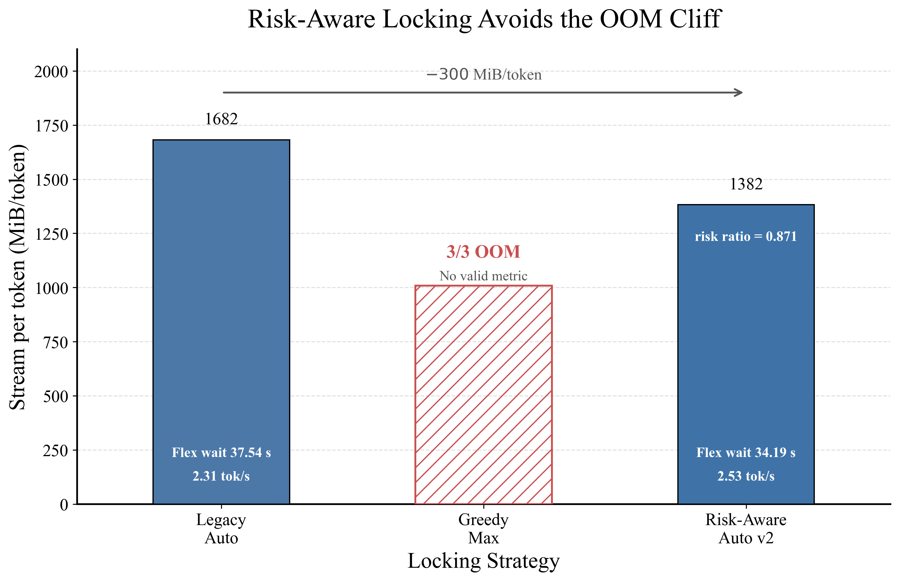
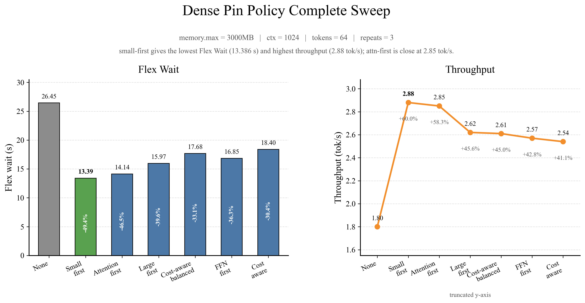
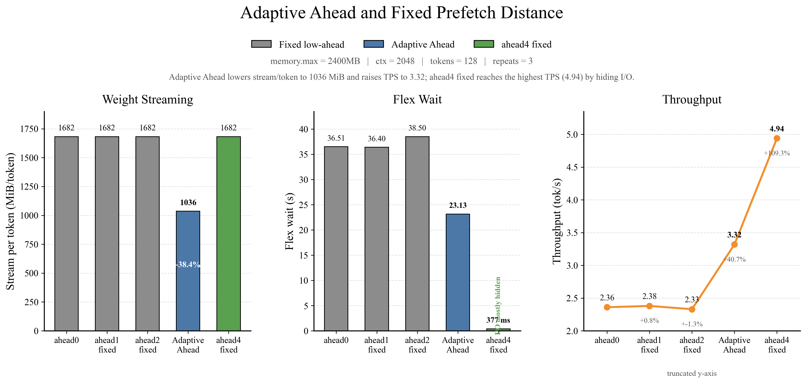
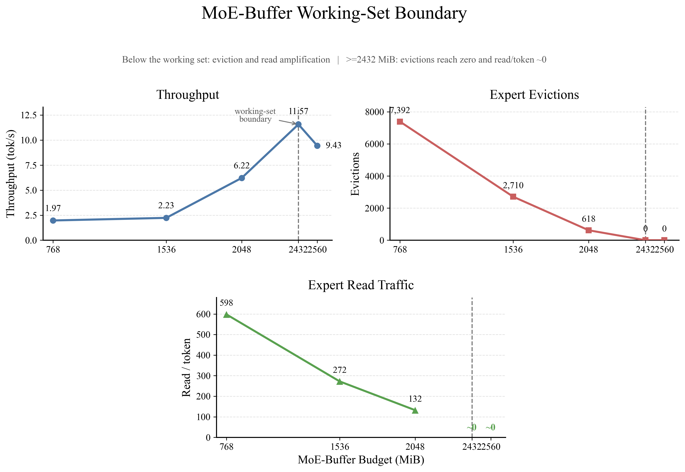
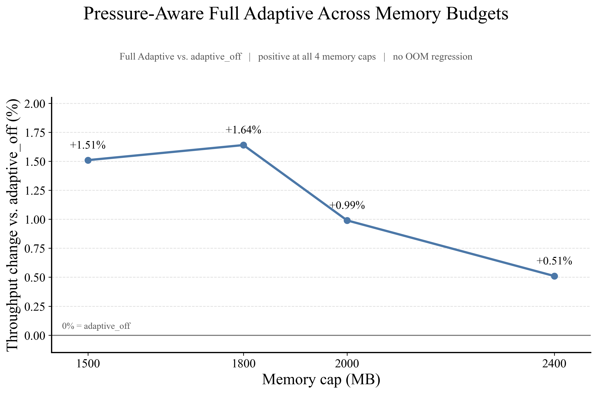
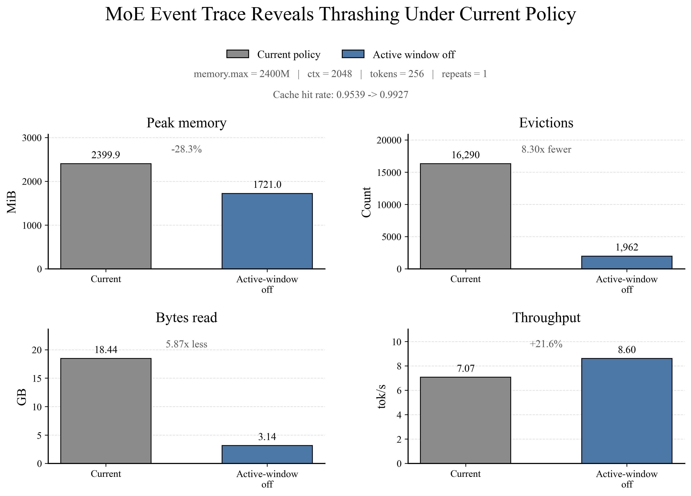
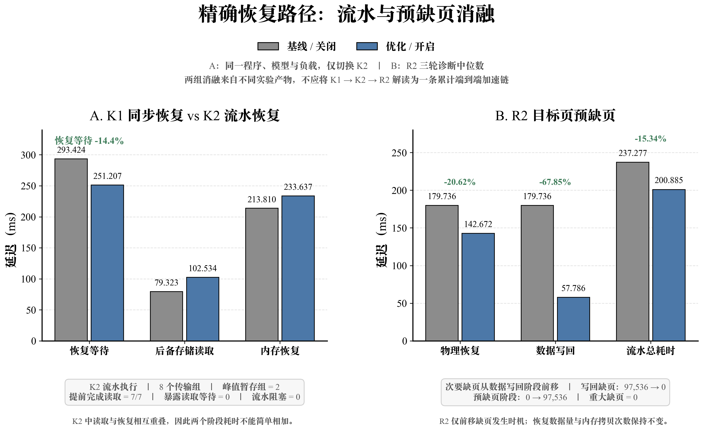
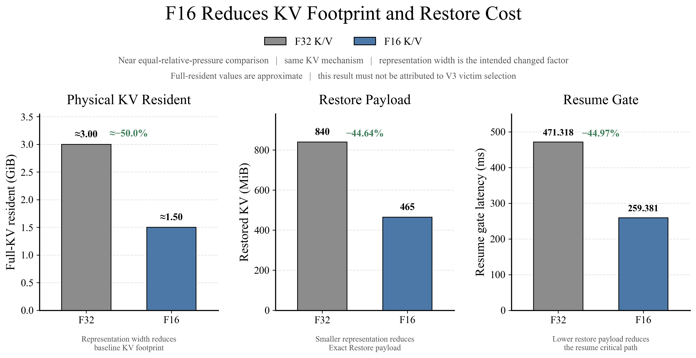

# FlexKV-OS（Flexible Weight-KV Runtime Memory System）开发文档


## 一、基本信息

### 1.1 队伍介绍

| 项目 | 内容 |
| :--: | :-- |
| **项目名称** | FlexKV-OS：面向内存受限 LLM 推理的权重-KV 协同流式内存系统 |
| **基础框架** | llama.cpp / ggml |
| **优化方向** | LLM 推理运行时内存治理、权重显式驻留、KV Cache 生命周期管理、Weight-KV-I/O 全局协调 |
| **适用场景** | 边缘设备、本地低内存环境、CPU 推理、长上下文与多会话场景 |
| **小组成员** | 苏安炫、李思甜 |
| **项目导师** | 夏文、李诗逸 |
| **仓库地址** | https://gitlab.eduxiji.net/T2026181239911430/project3136859-389161 |
| **参赛文档** | `docs/参赛文档.pdf` |

### 1.2 项目摘要

随着大语言模型从云端服务器逐步走向本地设备、边缘计算平台和嵌入式系统，模型权重规模持续增长、长上下文推理逐渐普及、多会话服务需求不断提升，物理内存容量与存储带宽已经成为端侧部署的关键瓶颈。

原生 `llama.cpp` 的 `mmap` 机制能够实现权重按需加载，但在内存受限场景下容易出现同步缺页、page cache 抖动和回收不可控等问题；同时，repack 可能形成额外匿名权重副本，造成文件页与匿名页重复驻留。另一方面，KV Cache 会随上下文长度和并发会话持续增长，idle Session 的历史 KV 即使暂时不参与当前 Attention，也可能长期占据物理页。因此，仅依赖操作系统被动调页难以满足资源受限环境下的高效推理需求。

针对上述问题，本项目基于 `llama.cpp` 设计并实现 **FlexKV-OS**。系统从权重加载、专家激活、KV Cache 生命周期和全局资源竞争四个层面进行协同优化：

- **Dense 权重路径**：通过 Dense Flex 将层权重转化为应用层显式管理对象，以层环形槽位（Layer Ring）、均衡锁定（Balanced Locking）、成本感知固定（Cost-aware Pin）、自适应预读（Adaptive Ahead）、清理回收（Clean Reclaim）和增量固定（Delta Pin）控制权重工作集；
- **MoE 权重路径**：通过 MoE Buffer，以 `(layer, expert)` / ExpertGroup 为基本管理粒度，结合缓存局部组（CLG）、专家活跃度监控（EAM）、成本感知通信传输（CCT）、组级驱逐（Group-level Eviction）、压力感知保护（Pressure-Aware Protection）与动态预算（Dynamic Budget）管理有限专家工作集；
- **KV Cache 路径**：将逻辑历史与物理驻留解耦，以 block/cell 为粒度维护 sequence/epoch ownership、物理 block state 与 backing identity。dead/unowned KV 通过 RELEASE 直接归还物理页；idle 但仍属于 live Session 的 KV 通过 OFFLOAD 写入固定槽位 backing 后释放 DRAM，并在 Session 重访前以 correctness-required PREFETCH 完成 Exact Restore。KV 侧进一步以 Physical Budget View 控制真实 resident target，以 Cost-aware Hot/Cold Ranking 选择低未来代价的 victim，并通过 Transfer Group、`READ(N+1)||RESTORE(N)` 流水和 Destination Prefault 降低恢复关键路径；
- **全局治理路径**：引入加载期 Memory Planner 与运行期 Server Memory Governor，统一协调 Dense、MoE、KV Cache 与 Prefetch 资源，形成 `Observe -> Decide -> Execute -> Feedback` 的闭环运行机制。

实验结果表明，系统能够在保持推理正确性的同时显著降低运行时物理内存占用。关闭 repack 后，Dense 模型 RSS 由 7.77 GB 降至 4.56 GB，MoE 模型 RSS 由 5.73 GB 降至 3.60 GB；MoE Buffer 可在 2 GB cgroup 限制下稳定运行。KV 受控实验中，F32 Resident 基线的 KV physical resident 约为 3.00 GiB：RELEASE-only floor 为约 1.291 GiB，对应 1.709 GiB（56.96%）的真实物理释放且不产生 backing I/O；V2 在 1.00 GiB target 下实际 resident 为 0.996 GiB、较 Resident 减少 66.8%，resume gate 约 190 ms，在 0.25 GiB target 下实际 resident 为 0.247 GiB、减少 91.8%，resume gate 约 478 ms。

### 1.3 项目核心工作

- **构建加载期 Memory Planner**  
  根据 cgroup `memory.max`、模型规模、模型结构、KV Reserve、安全余量、最大 Tensor 大小以及存储带宽等信息，在模型加载阶段自动选择 Dense Flex 或 MoE Buffer，并生成初始 Ring、Ahead、Lock Budget、Expert Budget 等配置。

- **实现 Dense Flex：Layer 级显式权重驻留**  
  将 Dense 模型权重从操作系统被动 `mmap/page cache` 路径转化为应用层可控的层级权重工作集，通过环形槽（Ring Slot）与后台异步I/O实现数据预取与计算流水线重叠，并利用均衡锁定（Balanced Locking）保障多线程并发安全；同时引入成本感知固定（Cost-aware Pin）和增量固定（Delta Pin）动态决定驻留优先级，配合自适应预读窗口（Adaptive Ahead）与惰性清理回收（Clean Reclaim），以及运行时环形槽位数量的弹性扩缩容（Runtime Ring Resize），最终形成一套完全由应用层掌控、低延迟高吞吐的权重流式管理闭环，有效规避内核态切换与缓存污染，使模型推理免受存储I/O瓶颈制约。

- **实现 MoE Buffer：Expert 级显式驻留**  
  利用混合专家（MoE）模型“全局稀疏、局部密集”的专家访问特征，以专家组（ExpertGroup）为管理粒度，通过热工作集估算器（Warm Working Set Estimator）与缓存局部组/专家活跃度监控（CLG/EAM）实时感知访问热度，结合成本感知通信传输（CCT）预测跨节点传输代价，并引入组级驱逐（Group-level Eviction）与压力感知保护（Pressure-Aware Protection）动态淘汰冷专家、避免热专家误换，配合清理回收（Clean Reclaim）与动态预算（Dynamic Budget）协同调节缓存资源水位，最终将完整的专家集合收敛为有限的高效动态工作集，有效降低跨节点通信开销与缓存抖动，使MoE模型在专家稀疏访问场景下仍保持稳定低延迟与高吞吐。

- **实现 KV Cache 运行时生命周期与物理驻留管理**  
  将KV的逻辑会话历史与物理驻留状态解耦，以块/单元（block/cell）为执行粒度维护所有权（ownership）、映射代数（mapping generation）、物理对象/代数（physical object/generation）和状态机。对已失效或无主的KV采用RELEASE直接释放物理页；对空闲但仍存活的KV采用OFFLOAD写入固定槽位后备存储（fixed-slot backing）后释放DRAM，并在会话重访前通过正确性必需的PREFETCH完成精确恢复（Exact Restore）。物理预算视图（Physical Budget View）以真实的常驻/可回收字节数驱动优先释放型（RELEASE-first）常驻控制器；代价感知冷热排序（Cost-aware Hot/Cold Ranking）综合专有物理释放量、OFFLOAD写入成本、复用/恢复代价与颠簸惩罚来选择驱逐对象；恢复路径采用连续传输组（contiguous Transfer Group）、组读取（grouped read）、READ(N+1)||RESTORE(N)有界流水线和目标预缺页（Destination Prefault），同时通过活跃/受保护/共享（active/protected/shared）、事务/代数（transaction/generation）与计算图门控（graph gate）共同保障正确性。

- **实现 Server Memory Governor 全局资源协调**  
  通过统一接收cgroup内存状态、常驻内存集（RSS）、Dense/MoE/KV各类资源状态、动作历史（Action History）与重分配额度（Reallocation Credit）等多维全局信息，结合压力门控（Pressure Gate）感知系统负载、分配选择（Auction Select）按需仲裁资源归属、异步动作执行器（Async Action Executor）非阻塞下发调整指令，并配合统一预取预算（Unified Prefetch Budget）平衡预取与存储开销，将分散的资源状态与历史行为转化为动态协同的分配策略，最终形成一套面向异构混合负载的资源调度闭环。

- **建立可验证的测试与观测体系**  
  使用 `llama-bench`、`llama-perplexity`、KV canonical benchmark、`mincore` physical resident 归因、cgroup v2 内存限制与模型绑定的多会话回放，对于 RSS（常驻内存集）、KV 物理驻留、RELEASE/OFFLOAD 释放量、精确恢复、TPOT/TPS（每输出令牌时间/每秒令牌数）、会话生命周期和推理正确性进行统一观测。

## 二、项目概述

### 2.1 背景与意义

LLM 推理通常分为 Prefill 和 Decode 两个阶段。Prefill 阶段并行处理输入 Token；Decode 阶段则逐 Token 自回归生成。Decode 阶段需要持续访问模型权重，并反复读取历史 KV Cache，因此主要存在三类数据搬运：

1. **权重 I/O**：每个 Decode Step 需要访问模型参数，是主要数据搬运来源之一；
2. **KV Cache I/O**：随上下文长度和并发数增长，在长上下文场景中可能接近甚至超过权重 I/O；
3. **激活 I/O**：主要来自中间激活 Tensor 的读写，Decode 阶段通常小于前两者。

在边缘设备、本地 CPU 和低内存机器上，问题进一步放大：

- DRAM 容量不足以容纳完整模型工作集；
- SSD / eMMC / UFS 等存储带宽远低于内存带宽；
- page fault 和同步 I/O 会阻塞推理线程；
- KV Cache 随上下文长度近似线性增长；
- Dense、MoE 和 KV Cache 具有不同访问模式，无法使用单一缓存策略；
- 权重、KV Cache 和预取数据共同竞争有限的内存与 I/O 带宽。

因此，本项目不再将问题限定为“怎样让模型加载进来”，而是转向：**在有限物理内存下，动态决定哪些数据需要驻留、哪些可以回收、哪些值得预取，以及释放后的资源应重新分配给哪个对象。**

### 2.2 当前任务主要痛点

#### 2.2.1 `mmap` 与 repack 带来的冗余驻留

原生 `llama.cpp` 主要依赖 `mmap` 与 page cache 管理模型权重。应用层无法精确控制某个 Layer 或 Expert 的真实物理驻留范围。当 repack / extra backend buffer 存在时，还可能形成额外匿名权重副本，进一步放大 RSS。

#### 2.2.2 Dense 与 MoE 模型的结构差异

Dense 模型每个 Token 都需要执行全部 Transformer Layer，访问顺序高度确定；MoE 模型则只激活 Top-K Expert，具有明显稀疏性和局部性。因此，两类模型需要分别采用 Layer-level 与 Expert-level 的工作集管理机制。

#### 2.2.3 KV Cache 动态增长与生命周期差异

KV Cache 是运行期持续生成的 Session 状态，其占用随上下文长度、并发 Session 数和 KV 表示宽度近似线性增长。与只读权重不同，KV 同时具有“逻辑历史仍有效”和“物理页是否驻留”两个维度：active Session 的 KV 直接参与 Attention，idle Session 的历史 KV 可能暂时不可见但后续仍会重访，而 dead/unowned KV 已经失去未来恢复价值。

因此，KV 优化不能简单等价为“删掉历史”或“按逻辑字节数换出”。FlexKV-OS 将 Session lifecycle 与 block physical lifecycle 解耦：dead/unowned 数据通过 RELEASE 直接归还物理页，idle live 数据通过 OFFLOAD 保存到有界 backing，重访时再通过 Exact PREFETCH/RESTORE 恢复，并以真实 physical resident 作为容量控制依据。

#### 2.2.4 局部优化容易引发资源竞争

Dense Prefetch、MoE Expert Prefetch、KV Resume Prefetch 与 KV Offload 都会占用存储带宽和物理内存。如果各模块独立扩大缓存或预取规模，可能形成瞬时 RSS 尖峰和 I/O 竞争，因此需要全局资源约束。

### 2.3 项目设计目标

FlexKV-OS 围绕四个目标展开：

1. **分析 LLM 推理过程中的访存行为特征**：显式提取 Dense Layer 顺序访问、MoE Expert 稀疏激活与 KV Cache 生命周期信息；
2. **利用显式驻留管理降低运行时物理内存占用**：将权重与 KV Cache 转化为应用层可调度资源；
3. **利用预测预取隐藏数据加载延迟**：通过后台 I/O 将数据准备与推理计算重叠；
4. **构建 Weight-KV-I/O 全局资源协调机制**：通过 Memory Planner 与 Server Memory Governor 统一调度内存和 I/O 资源。

### 2.4 系统总体架构


FlexKV-OS 采用四层运行时内存治理架构：

#### 2.4.1 推理执行层

负责 Transformer Layer、Attention、MoE Router、Expert 计算与 Token 生成。该层保持原有模型计算逻辑不变，只向运行时治理层暴露当前 Layer、Token、Expert 与 Session 状态。

#### 2.4.2 全局控制与调度层

由以下模块组成：

- **Memory Planner**：加载期资源规划与后端选择；
- **Server Memory Governor**：运行期全局资源治理；
- **Prefetch Scheduler**：根据模型访问规律生成预取请求；
- **Resource Monitor**：采集 RSS、cgroup、Resident Set、KV 状态与 I/O 压力。

#### 2.4.3 专用内存管理层

根据数据访问模式分别管理：

- **Dense Flex**：Layer Working Set；
- **MoE Buffer**：ExpertGroup Working Set；
- **KV Cache Backend**：block/cell ownership 与 physical state、Physical Budget View、RELEASE/OFFLOAD/PREFETCH、Exact Restore、claimant Hot/Cold ranking。

#### 2.4.4 底层虚拟内存与存储层

由 Linux Virtual Memory、DRAM、SSD、`mmap`、`madvise`、`pread`、`O_DIRECT`、page cache 等机制提供底层能力。FlexKV-OS 不替代操作系统内存管理，而是在其之上增加模型结构感知的用户态控制层。

### 2.5 核心技术与模块架构

FlexKV-OS 的核心不是单独增加一个缓存，而是将 **Dense Layer、MoE Expert、KV Cache 与 Prefetch I/O** 转化为可观测、可预算、可回收、可恢复的运行时资源对象。系统在加载期通过 Memory Planner 生成初始配置，在推理期通过各专用 Backend 执行显式驻留管理，再由 Server Memory Governor 统一协调资源竞争。

| 核心机制 | 管理对象 | 主要作用 |
| --- | --- | --- |
| **Memory Planner** | 模型权重、KV Reserve、初始预算 | 加载期识别模型结构和 cgroup 约束，自动选择 Dense / MoE 后端并生成初始资源配置 |
| **Dense Flex** | Dense Layer / Tensor | 通过 Layer Ring、Pin、Prefetch、Reclaim 等机制控制稠密权重物理驻留范围 |
| **MoE Buffer** | `(layer, expert)` / ExpertGroup | 仅维护高价值 Expert 工作集，按需加载、预测预取、驱逐和动态调整预算 |
| **KV Cache Manager** | KV block/cell、Session claimant、physical resident | 通过 RELEASE/OFFLOAD/PREFETCH、Physical Budget、Exact Restore 与 Hot/Cold ranking 管理 KV 生命周期和物理驻留 |
| **Server Memory Governor** | Dense、MoE、KV、Prefetch | 根据全局内存压力统一决定回收、扩缩容、预取和资源再分配 |

#### 2.5.1 Memory Planner：加载期自动后端选择与初始预算规划

Memory Planner 位于模型加载路径，其目标是解决“**模型刚加载时应该采用哪一种显式驻留后端、各模块初始能拿多少内存**”的问题。Planner 不把全部可用内存直接交给权重，而是同时考虑模型固定开销、KV Cache 预留、最大 Tensor、安全余量以及存储/计算能力，先建立一个可运行的资源基线。

主要机制包括：

- **cgroup-aware Resource Sensing**：读取 `memory.current / memory.high / memory.max` 等信息，获取当前进程真实可使用的内存边界。相比只读取主机总内存，这一机制能够正确模拟端侧模型运行时的内存受限环境。

- **Model Weight Profiling**：遍历 GGUF 权重 Tensor，统计模型总权重、最大 Tensor、Layer 权重与 Non-Layer 权重。Embedding、Output、Final Norm 等不属于 `blk.N.*` 的 Tensor 被视为固定内存，避免 Planner 错把这部分预算分配给流式窗口。

- **KV Reserve Estimation**：根据各层 `n_head_kv`、K/V Head Dimension 与元素字节数估算每 Token 的 KV 开销，并据此预留 KV Cache 空间。这样可以避免权重缓存把可用 DRAM 全部占满，导致长上下文阶段没有 KV 增长空间。

- **Automatic Backend Selection**：根据 `hparams.n_expert` 判断模型结构：Dense 模型自动进入 Dense Flex，MoE 模型进入 Lazy Window + MoE Buffer。两条权重控制路径保持互斥，避免重复管理同一批 Tensor。

- **Duplicate Residency Avoidance**：当显式权重驻留后端启用时，关闭与其重复的传统 eager mapping / extra backend buffer 路径，避免重新形成完整权重副本。

**Dense Planner v2** 进一步包含以下机制：

- **Layer / Non-Layer Classification**：按 Tensor 名称将 `blk.N.*` 权重归入对应 Transformer Layer，其余权重作为固定内存地板单独统计，为 Ring、Lock 与 Streaming 预算建立准确边界。

- **I/O–Compute Ratio Planning**：根据存储带宽估算完整 Layer Streaming 的 I/O 时间，并与计算时间代理值比较，得到 `rho = T_io / T_compute`。当 I/O 相对较轻时可使用更大的 Ahead / Ring；当 I/O 已成为主要瓶颈时则收缩窗口，避免盲目扩大预取造成额外内存占用。

- **Ring / Ahead Planning**：Planner 根据 `rho` 与内存余量生成初始 Ring Slot 数和预取 Ahead 层数，为 Dense Flex 的运行期滑动窗口提供初始配置，而不是依赖固定人工参数。

- **Risk-aware Lock Search**：在 cgroup `memory.max` 下估计 `current + fixed + ring + lock` 的总驻留风险，只在风险不超过安全阈值、且新增 Lock 能显著减少 Streaming Bytes 时接受更大的 Lock Budget，从而避免“锁得越多越好”的简单策略。

- **Stream-benefit Check**：新增长期驻留 Tensor 必须带来足够的 `stream_per_token` 减少，否则即使仍有剩余内存，也不会继续扩大 Lock 集合，使内存投资优先用于真正能减少重复 I/O 的对象。

**MoE Budget Planner v2** 则围绕 Expert Working Set 进行预算规划：

- **Expert Tensor Identification**：通过 `_exps`、Tensor 维度和 Expert 维识别专家权重，将这些 Tensor 注册到 MoE Buffer，避免继续交给普通 Window 进行粗粒度处理。

- **Warm Working Set Estimation**：根据 Expert 的访问统计、热度、复用距离和 Group 大小估算当前 workload 所需的 Warm Working Set，为 Expert Budget 提供数据驱动的目标值。

- **Soft Guard / Hard Floor**：在 `memory.max` 下同时设置安全预算与最低可运行预算。Planner 会尽量覆盖必要 Expert 工作集，但不会突破硬安全边界，从而在“尽量多缓存 Expert”和“避免 OOM”之间取得平衡。

- **Safe Budget Clamping**：最终 Expert Budget 由 `warm_working_set` 与 `safe_budget` 共同限制；在内存充足时优先覆盖活跃专家集合，在内存受限时自动收缩到安全范围。

#### 2.5.2 Dense Flex：Layer 级显式权重驻留


Dense 模型每个 Token 都会按固定顺序遍历全部 Transformer Layer，因此其权重访问高度可预测。Dense Flex 利用这一特征，把原本由 `mmap/page cache` 被动决定的物理驻留集合，转化为应用层可显式控制的 **Layer Working Set**。


核心机制如下：

- **Layer Ring / Slot Lifecycle**：系统预先建立固定数量的匿名 Slot，每个 Slot 在某一时刻对应一个 Layer。优先使用空闲 Slot；当 Ring 已满时，从已完成计算且允许释放的 Layer 中选择最久未使用对象作为 Victim。这样可以把 Dense 权重物理驻留范围限制在有限窗口内。

- **Request–Wait–Get–Release 闭环**：推理线程在进入某个 Layer 前先发起 Request；若权重尚未驻留，则后台 Worker 加载并由计算线程 Wait；数据就绪后通过 Get 获取重定向后的 Tensor 地址；Layer 使用完成后执行 Release。该闭环保证流式加载不会破坏原有 GGML 计算顺序。

- **Background I/O Worker**：权重加载从计算线程中拆出，由后台线程从 GGUF 文件读取未长期锁定的 Tensor。计算与 I/O 可以并行进行，从而尽可能把存储访问延迟隐藏在前一个 Layer 的计算时间中。

- **`pread` / `O_DIRECT` Streaming**：普通模式使用 `pread` 精确读取所需权重；启用 `O_DIRECT` 时通过对齐 Bounce Buffer 访问存储，并分别记录逻辑 Streaming Bytes 与物理读取 Bytes，用于分析对齐造成的 Read Amplification。

- **Tensor Pointer Repoint**：Layer 权重加载到匿名 Ring 后，不修改 Tensor 数值，而是将 GGML 计算使用的 `tensor->data` 指向当前有效驻留副本。该机制只改变权重的物理位置，不改变模型计算语义。

- **Balanced Locking**：加载期 Lock Budget 按 Layer 尽量均衡分配，避免少数层几乎全部常驻、而其他层每个 Token 仍需完整 Streaming。其目标是减少全模型范围内的重复读盘量，而不是只优化局部层。

- **Cost-aware Pin**：在固定 Lock Budget 内，根据候选 Tensor 的收益/成本比选择长期常驻对象。高 ROI Tensor 优先被 Pin，使有限内存优先投入到能显著降低访问延迟或 Streaming Bytes 的权重上。

- **Adaptive Ahead**：运行期持续统计 I/O、计算和等待时间的 EWMA，根据真实 `T_io / T_compute` 动态调整 Ahead 层数。当 I/O 可以被计算覆盖时适度扩大预取；当等待上升或 Ring 空间不足时主动缩小 Ahead，避免无效预取。

- **Unified Prefetch Budget 接入**：每个预取 Layer 都需要消耗全局 Prefetch Budget。若未来 Layer 的预取消耗超过当前额度，请求会被丢弃或延后，从而避免 Dense 预取与 MoE/KV 恢复同时扩大造成瞬时 RSS 尖峰。

- **Clean Reclaim**：对于已经消费完成、当前不再计算的 Layer Slot，调用 `madvise(MADV_DONTNEED)` 释放对应匿名物理页。逻辑 Slot 仍然存在，但真实 RSS 可以下降，为其他资源让出物理内存。

- **Runtime Ring Resize**：Governor 可以在运行期扩大或收缩 Ring。Grow 分配新的 Slot；Shrink 只删除当前空闲 Slot，不强制驱逐正在使用的数据，因此属于 Best-effort、Non-destructive 的安全调整。

- **Delta Pin / Reinvestment**：当 Clean Reclaim 等动作真正释放出内存后，系统可把部分回收收益重新投资到高 ROI Tensor，异步建立新的 Delta Pin。这样 Dense Flex 不只是“不断回收”，而是形成“释放低价值对象—增加高价值常驻”的闭环。

Dense Flex 的设计目标并不是让极端低内存 Dense 推理完全摆脱 I/O，而是建立明确的权重驻留边界：在内存低于完整模型工作集时首先保证**不因全量驻留而 OOM**，随后再通过 Lock、Pin、Ring 和 Prefetch 尽量降低 `stream_per_token`。

#### 2.5.3 MoE Buffer：Expert 级显式驻留


MoE 模型虽然总参数规模更大，但单 Token 仅由 Router 激活 Top-K Expert，因此真正需要访问的权重集合远小于完整模型。MoE Buffer 利用这种“**全局稀疏、局部密集**”特征，以 `(layer, expert)` / ExpertGroup 为管理单位维护有限的 Expert Working Set。

核心机制如下：

- **ExpertGroup 管理粒度**：系统不以整层或整个 `_exps` Tensor 作为最小缓存对象，而是细化到 `(layer, expert)`。这样不同 Layer 的 Expert 可以独立加载、命中和驱逐，减少无效专家权重随整层一起驻留。

- **Virtual Tensor / Physical Working Set 解耦**：MoE Buffer 为完整 Expert Tensor 建立逻辑上等尺寸的匿名虚拟 Buffer，但只有真实加载过的 Expert Slice 才形成物理页驻留，因此“虚拟地址空间完整”并不意味着“全部专家都占用 RSS”。

- **Expert Slice Streaming**：当 Router 真正需要某个 Expert 时，仅从 GGUF 中读取该 Expert 对应的 Gate / Up / Down Slice，并写入其匿名 Buffer 区域。这样能够把全量专家加载转化为按需切片加载。

- **Demand Admission**：真实访问发生时，系统先检查 Expert 是否已驻留以及当前 Budget 是否允许缓存。只有满足空间与收益条件的 Expert 才进入 Resident Set，避免一次性访问的低价值 Expert 污染有限缓存。

- **Warm Working Set Estimator**：根据 `seq_access`、累计访问次数、`hot_score`、跨 Token 复用距离以及 Group 大小估计 Expert 的未来收益，并按层排序累计到目标 coverage。该机制为“需要多少 Expert Budget”提供可解释的工作集估计。

- **Ranked Prefetch Queue**：预测得到的 Expert 不直接无序提交，而是按预测分数和收益排序进入异步预取队列。高概率、高价值 Expert 优先获得 I/O 机会，提高有限带宽下的预取有效性。

- **Group-level Eviction**：当 Buffer 达到预算上限时，不随机驱逐，而是综合未来使用距离、近期使用频率、预测置信度、层局部性与当前系统压力等多维指标为候选 ExpertGroup 计算驱逐分数，优先淘汰低收益对象。

- **Pressure-Aware Protection**：热点保护、活跃窗口、和推测性保护内容均非固定不变，当 Resident / Budget 比例升高时，保护系数逐步减弱，使原本被保护的低价值对象在高压力下也能够参与回收，防止保护策略把缓存“锁死”。

- **Clean Reclaim**：对于 Cold 且可安全释放的 Resident ExpertGroup，调用 `MADV_DONTNEED` 归还匿名页。回收量被记录到全局 `Raw Relieved`，并可进一步进入 Reallocation Credit 流程。

- **Dynamic Budget**：Governor 可以在运行期改变 MoE Budget。预算扩大时为未来 Expert 加载提供更多空间；预算收缩时优先释放空闲或低价值对象，不破坏当前正在使用的 Expert。

MoE Buffer 的核心目标是把“完整专家集合”转化为“有限动态工作集”。当 Budget 覆盖当前 workload 的活跃 Expert 后，eviction 和 read/token 会快速下降；当 Budget 低于工作集边界时，则会出现频繁驱逐和重复加载，这一点也与后续实验中的明显拐点相对应。

#### 2.5.4 MoE Predictor：CLG、EAM 与 CCT

MoE 访问虽然由 Router 动态决定，但相邻层和相邻 Token 的 Expert 选择仍具有一定局部性。FlexKV-OS 将预测机制用于“**提前准备可能需要的 Expert**”，而不是替代真实 Router 决策。

- **CLG（Cross-Layer Gate）**：利用跨层 Gate / Router 相关性预测后续 Layer 可能访问的 Expert，并把预测结果直接转化为 MoE Buffer 的异步 Prefetch 请求。CLG 的价值在于把未来 Expert 的 I/O 提前到当前 Layer 计算期间执行，增加 I/O-Compute overlap。

- **EAM（Expert Access Model）**：在真实 Router 结果产生后更新跨层 Expert 转移统计，维护“当前 Expert → 后续若干层 Expert”的经验概率。预测阶段根据历史转移频率为候选 Expert 打分，只将超过阈值的对象放入 Ranked Prefetch Queue，从而减少低置信度预取。

- **CCT（Confidence-Controlled Transition）**：以类似饱和计数器的置信度表示 Expert 转移稳定性。CCT 主要参与 Retention 和 Eviction Protection——高置信度对象在正常压力下更值得保留，但在高内存压力下其保护仍可被削弱。

- **Prediction Safety Fallback**：CLG / EAM / CCT 只影响“提前加载”和“保留多久”。如果预测错误，真实 Router 结果仍通过 Demand 路径触发加载，并在 GEMM 前完成同步兜底，因此预测失误最多造成性能损失，不会改变模型选择的真实 Expert 或数值结果。

#### 2.5.5 KV Cache 运行时内存管理


KV Cache 与只读模型权重不同，它是推理过程中动态生成的 Session 状态。FlexKV-OS 将其拆分为 **Exact 物理生命周期执行、Physical Resident Budget 控制、Cost-aware Hot/Cold 选择、Exact Restore 数据路径和多会话 lifecycle** 五个相互配合的层次。KV core 维护物理事实与 correctness authority，Server/Governor 维护 Session 生命周期、预算与 victim policy，从而把“逻辑历史是否存在”和“物理页是否当前驻留”彻底分离。

- **Block / Cell 物理生命周期**：系统以固定 block size 管理连续 KV tensor 上的单元，并为每个单元记录其所属序列、映射代数、物理对象/代数以及块状态。对于已失效且无需再恢复的 KV，统一释放流程，Unified RELEASE 在重新检查其所属状态后执行 page-aligned `madvise(MADV_DONTNEED)`；而对于处于空闲状态但仍属于活跃会话且可恢复的 KV，OFFLOAD 先将完整数据写入 fixed-slot backing，只有完整 I/O 成功后才发布 `SWAPPED`，随后释放 live tensor 页。

- **Fixed-slot Backing 与事务安全**：每个物理单元都映射到后备存储中一个大小固定的有界区间，反复执行换出（OFFLOAD）时始终复用同一槽位，从而避免交换文件随系统运行时间无限膨胀。对于短读、短写、文件结束、磁盘空间不足、I/O 错误等异常情况，均通过结构化的返回值和故障停止机制向上层明确传递；任何处于活跃（active）、受保护（protected）、共享（shared）状态，或正处于写事务中，又或身份标识与代数不一致的对象，都不会被纳入可能破坏数据一致性的回收流程。

- **Physical Budget View 与 RELEASE-first Controller**：系统通过 `mincore` 和 KV 对象的常驻视图获取真实的常驻内存字节数`resident_bytes`、可回收的失效数据量`dead reclaimable`、所有权`ownership`以及映射代数 `generation`，并以稳定的物理常驻目标为基准计算出需要释放的超额部分。回收流程严格遵循既定顺序：先尝试达到目标，接着释放失效的 KV，然后重新采样，再换出空闲但仍属活跃会话的 KV，最后再次采样。这一设计确保系统不会将逻辑上的 KV 数据规模或 I/O 传输字节数，误当作实际可缓解的 DRAM 压力。


- **Cost-aware Hot/Cold Claimant Ranking**：多个空闲但仍存活的会话同时竞争常驻内存预算时，系统首先执行一系列安全门控检查，仅通过检查的候选者才进入排序环节。排序依据是单位物理字节的预期驱逐代价，计算公式如下：

  ```text
  Score(s) =
      (T_offload(s) + P_reuse(s) * T_restore(s) + T_churn(s))
      / estimated_exclusive_physical_bytes(s)
  ```
   其中 `estimated_exclusive_physical_bytes` 表示当前决策时刻，基于 mincore 与所有权统计得到的专有常驻内存估算值；换出代价`T_offload`和恢复代价`T_restore`均来自真实的历史动作记录；往返抖动`round-trip`则通过颠簸惩罚项`T_churn`加以抑制。每次恢复后，系统会为该会话设置一段常驻时长，避免刚换入的 KV 被立即再次驱逐。当同一决策中各个候选项的代价权威信息不完整时，系统统一采用空闲时长权威进行排序，以防止不同量纲的分数混杂导致排名失真。

- **Exact PREFETCH 与 Graph Gate**：对话被重新访问时，其恢复操作独立于软驱逐策略。服务器在构建计算图之前，先对目标序列进行保护，并提交正确性必需且全部必需的预取请求；只有当读取正确性、身份验证、状态提交以及短缺检查全部通过之后，才允许执行 `llama_decode()`。任何预测或策略决策只会影响性能，而不会影响模型的正确性

- **Transfer Group + Read/Restore Pipeline**：将相邻的已换出（SWAPPED）物理块按字节上限合并为连续的传输组，通过组后备读取`grouped backing read`减少小粒度 I/O 次数。恢复过程采用有界读取工作线程和双暂存区，并固定预取窗口大小为 1，形成 READ(G[i+1]) || RESTORE(G[i]) 的流水线。
- **Destination Prefault**：在 scatter 前对目标 KV tensor 的页对齐写范围执行 `MADV_POPULATE_WRITE`，主动建立目的物理页，将首次写入产生的缺页异常前移，降低恢复阶段的同步缺页抖动。

- **扩展协同层**：KV claimant 的物理内存释放量`physical relief`、复用/恢复代价`reuse/restore cost`、I/O 任务及其截止时间`I/O task and deadline` 均可接入统一的内存管理器与 I/O 仲裁机制；精确前缀缓存、冷 KV 表示以及查询感知的选择性加载可作为与主生命周期正交的数据复用与传输层设计，默认情况下，以正确性为优先的精确恢复与计算图门控为最终正确性边界。


KV Cache 管理不以截断历史上下文作为节省内存手段。系统始终区分 logical KV bytes、backing I/O bytes 与 physical resident/relief：前者描述 Session 数据规模，中间项描述迁移开销，后者才表示 DRAM 中真实驻留或释放的物理内存。

#### 2.5.6 Server Memory Governor：全局运行时治理


Server Memory Governor 位于 `tools/server/server-context.cpp`，负责把 Dense、MoE、KV 和 Prefetch 从多个独立局部策略提升为统一的资源治理闭环。其输入包括 cgroup 内存状态、各模块常驻内存集、可回收字节数、缓存命中/未命中信息、历史调度动作与可分配内存大小；输出则是缓冲区大小调整、数据回收/释放/卸载、预算分配和预取等决策，从而在全局层面实现内存资源的动态调度与高效利用。

核心机制如下：

- **Pressure Observation**：周期性读取 `memory.current / memory.high / memory.max`、RSS 和各 Backend 统计，计算当前内存松弛度与压力水平，使所有资源决策基于统一的系统状态，而不是各模块各自判断“内存是否紧张”。

- **Pressure Gate**：根据当前压力将系统划分为 Normal、Pressure 和 Critical 等状态，并限制各状态允许执行的动作。正常状态主要允许预取和资源扩展；进入压力后优先回收、缩容；Critical 状态则允许更强的释放 / 卸载，从策略层面防止低优先级动作继续放大内存压力。

- **Unified Candidate Abstraction**：Dense Layer、MoE ExpertGroup、KV Global 与 KV Sequence 都被统一表示为包含 `kind / action / id / score / roi / bytes / reason` 的候选队列，使不同资源类型可以进入同一个选择框架，而不再各自维护完全独立的决策逻辑。

- **Auction Select / ROI Ranking**：通过 Score、ROI 与 Bytes 对候选动作进行排序，优先选择单位资源收益更高的操作。其目标不是单纯“释放最多字节”，而是在回收量、未来访问代价和性能影响之间选择更优动作。

- **Async Action Executor**：Dense/MoE权重清理回收、KV全局释放及序列卸载等可能产生较大延迟的动作由异步执行器处理，并使用进行中标记防止同类操作重复并发，降低 Governor 对推理主线程的阻塞。

- **Unified Prefetch Budget**：Dense预读、、MoE专家预取和KV恢复预取三者纳入统一的全局预取预算，其中KV恢复预取优先，剩余预算再根据 Dense / MoE 当前未命中率动态分配，避免三个模块同时扩大预取造成内存尖峰与 I/O 带宽争抢。

- **Clean Reclaim Coordination**：Governor 统一调用 Dense `llama_flex_reclaim_released`、MoE `llama_moe_buffer_reclaim_clean`，并协调 KV Release / Offload。不同 Backend 的回收结果进入同一统计口径，为后续资源再分配提供依据。

- **Reallocation Credit**：系统不会把“发起了回收动作”直接视为获得可用资源，而是等待 `memory.current` 的真实下降确认实际释放效果。确认后的新的空闲内存经过衰减、上限约束和压力防护三层约束后，才能重新分配给MoE缓冲区、Dense流式窗口或KV Cache恢复预取，形成“释放—确认—再使用”的闭环。

- **Observation Marker**：统一输出 Planner、Pressure、Dense、MoE、KV 和 Global 指标，包括 Pressure EMA、Resident Coverage、KV Offload Ratio、Global Slack 等，为实验复现、消融分析和运行时调试提供统一证据。

通过上述机制，FlexKV-OS 的运行时资源路径由传统的“缺了再加载、满了再回收”转变为以 **Compute -> Observe -> Decide -> Execute -> Feedback** 为基本闭环，实现 Weight-KV-Prefetch 的全局协同治理。

### 2.7 关键源码落点

| 实现链 | 核心文件 | 主要职责 |
| --- | --- | --- |
| 加载期规划 | `src/llama-model.cpp` | cgroup 感知、模型结构识别、Dense/MoE 后端选择、Planner |
| Dense 权重路径 | `src/llama-flex.cpp` | Layer Ring、Streaming、Lock/Pin、Reclaim、Resize、Delta Pin |
| MoE 权重路径 | `src/llama-moe-buffer.cpp` | ExpertGroup、预测、Prefetch、Eviction、Budget、Reclaim |
| 推理期接入 | `src/llama-context.cpp` | Dense / MoE CPU Hook、Weight Stream Callback、Op Override |
| KV 生命周期与策略 | `src/llama-kv-cache.cpp`、`src/llama-kv-cache-action.h`、`tools/server/server-kv-pressure-action.cpp`、`tools/server/server-kv-resume.cpp` | block/cell lifecycle、Physical Budget、RELEASE/OFFLOAD/PREFETCH、Exact Restore、Hot/Cold ranking |
| KV 多会话执行 | `scripts/multi_session_replay.py`、`scripts/run-kv-offload-benchmark.py`、`scripts/parse-kv-offload-benchmark.py` | model-bound replay、Session lifecycle、physical/action evidence 与 fail-closed parsing |
| 全局治理 | `tools/server/server-context.cpp` | Pressure Gate、Auction、Async Action、Unified Prefetch、Credit |


## 三、项目目标与完成情况

### 3.1 目标完成情况

| 目标 | 完成情况 | 说明 |
| --- | :---: | --- |
| **目标 1：LLM 推理访存行为分析** | 完成 | 已分析 Dense Layer 顺序访问、MoE Expert 稀疏激活与 KV Cache 随上下文增长的规律 |
| **目标 2：显式驻留管理降低 RSS** | 完成 | 已实现 Dense Flex、MoE Buffer，以及 KV RELEASE/OFFLOAD/PREFETCH、Physical Resident Budget 与 Exact Restore 等运行时内存管理机制 |
| **目标 3：预测预取与计算-I/O 重叠** | 完成 | 已实现 Dense Ahead、MoE CLG/EAM Prefetch，以及 KV Transfer Group + bounded Read/Restore Pipeline |
| **目标 4：Weight-KV-I/O 全局资源协调** | 完成核心框架 | 已实现 Memory Planner、Server Memory Governor、Unified Prefetch Budget 与 Reallocation Credit |

### 3.2 核心功能完成情况

| 实现内容 | 对应目标 | 完成情况 | 说明 |
| --- | --- | :---: | --- |
| 基础环境搭建与访存特征分析 | 目标 1 | 完成 | 完成 `llama.cpp` 编译部署、cgroup v2 受限环境与访存行为分析 |
| 加载期 Memory Planner | 目标 2、4 | 完成 | 根据资源约束与模型结构自动生成初始资源配置 |
| Dense Flex 权重管理 | 目标 2、3 | 完成 | 实现 Layer-level 权重流式管理与显式驻留控制 |
| MoE Buffer 专家管理 | 目标 2、3 | 完成 | 以 ExpertGroup 为粒度维护有限动态专家工作集 |
| KV Cache 运行时管理 | 目标 1、2、3 | 完成 | 实现 block/cell 生命周期、Physical Budget、RELEASE/OFFLOAD/PREFETCH、Exact Restore、Hot/Cold claimant ranking 与多会话 lifecycle |
| 统一预取与 I/O 重叠调度 | 目标 3、4 | 完成核心框架 | 根据全局资源状态动态分配预取额度 |
| 全局资源协调与再分配 | 目标 4 | 完成核心框架 | 实现 Server Memory Governor 与 Reallocation Credit 闭环 |
| 系统集成与验证 | 目标 1-4 | 完成验证 | 完成 RSS、KV physical resident / Exact Restore、多会话 lifecycle 和模型兼容性测试 |

### 3.3 项目开发计划

| 阶段内容 | 时间安排 |
| --- | --- |
| LLM 推理机制调研、`llama.cpp` 源码分析、GGUF 文件结构研究与环境搭建 | 第 1-2 周 |
| Dense Layer Streaming、MoE Expert Buffer 原型与正确性验证 | 第 3-5 周 |
| KV Cache Exact 生命周期、Physical Resident Budget、恢复执行器与长上下文测试 | 第 5-6 周 |
| 异步预取机制、计算与 I/O 重叠及参数调优 | 第 6-7 周 |
| Memory Planner 与 Server Memory Governor 基础架构 | 第 8 周 |
| Unified Prefetch Budget、Dynamic Budget、Reallocation Credit | 第 9 周 |
| Dense、MoE、KV、Memory Governor 独立消融实验 | 第 10-11 周 |
| 不同模型规模、memory cap 与存储条件下的稳定性测试 | 第 12 周 |
| I/O 路径、缓存策略、资源调度和长上下文/多会话适应性优化 | 第 13-14 周 |

### 3.4 项目分工

| 小组成员 | 分工内容 |
| --- | --- |
| **苏安炫** | 负责 LLM 权重侧优化，包括 `llama.cpp` / GGUF 分析、Dense Flex、MoE Buffer、权重预取与性能测试；负责 Memory Planner 中权重侧预算规划接口 |
| **李思甜** | 负责 KV Cache 与运行时内存管理，包括 block/cell 生命周期、Physical Budget、RELEASE/OFFLOAD/PREFETCH、Exact Restore、Hot/Cold 策略、压力调度与多会话测试；负责 Memory Governor 中 KV 资源状态接口 |
| **共同负责** | 系统总体架构、Server Memory Governor 集成、Weight-KV-Prefetch 全局协调、Benchmark、结果分析、参赛文档与答辩材料 |


## 四、系统测试结果

### 4.1 测试环境

本项目所有实验均在统一物理环境下完成，以保证不同优化模块之间的可比性。测试过程中分别启用或关闭权重管理、MoE Buffer、KV Cache 管理以及全局调度优化模块，并通过 cgroup v2 的 `memory.max` / `memory.high` 构造不同内存压力环境。

| 项目 | 配置 |
| --- | --- |
| Linux 发行版 | Ubuntu 22.04 |
| Linux 内核 | 5.15.0+ |
| 机器模式 | 物理机 |
| 内存大小 | 23 GB |
| 处理器 | x86-64，8 核 |
| 存储设备 | SSD，顺序读速约 279 MB/s |
| Dense 测试模型 | Llama-3-8B-Instruct-Q4_K_M.gguf |
| Dense 模型大小 | 约 4.58 GB |
| MoE 测试模型 | Qwen1.5-MoE-A2.7B-20-experts-SFT-trained.Q4_K_M.gguf |
| MoE 模型结构 | 24 个 MoE Layer，每层 20 个 Expert，Top-4 激活 |
| 内存限制方式 | cgroup v2（`memory.max` / `memory.high`） |
| 测试工具 | `llama-bench`、`llama-perplexity`、trace replay、`mincore` physical resident 观测 |

测试主要围绕以下三个目标展开：

1. 验证系统是否能够降低大模型推理过程中的真实物理内存占用；
2. 验证权重流式加载、缓存驻留以及运行时调度机制是否能够降低 I/O 等待并维持可接受吞吐；
3. 验证优化路径是否保持与原始 `mmap` 推理路径一致的计算语义与 Session 连续性。

### 4.2 Dense 模型权重管理测试

#### 4.2.1 Repack 优化与基础内存降低

| 配置 | RSS | 吞吐 | 说明 |
| --- | ---: | ---: | --- |
| Dense native（含 Repack） | 7.77 GB | 8.15 tok/s | `mmap + repack` 匿名副本 |
| Dense（关闭 Repack） | 4.56 GB | 8.60 tok/s | 消除额外权重复制 |
| MoE native（含 Repack） | 5.73 GB | 19.26 tok/s | Expert 全量驻留趋势 |
| MoE（关闭 Repack） | 3.60 GB | 19.58 tok/s | Buffer 直接管理 Expert 权重 |


关闭 Repack 后，Dense 模型 RSS 从 7.77 GB 降至 4.56 GB，减少约 3.21 GB；MoE 模型 RSS 从 5.73 GB 降至 3.60 GB，减少约 2.13 GB。两类模型吞吐均未下降，说明 Repack 形成的额外匿名权重副本是可消除的重复物理驻留，为后续显式 Residency 与 Expert Buffer 提供了更多内存空间。

#### 4.2.2 Dense 显式 Residency 机制

| 配置 | Stream / token | Flex Wait | TPS |
| --- | ---: | ---: | ---: |
| 无显式 Residency | 2684 MiB/token | 25694 ms | 1.77 tok/s |
| 当前 Residency 配置 | 612 MiB/token | 6630 ms | 5.18 tok/s |


引入显式权重 Residency 后，每 Token 权重流式读取量由 2684 MiB 降至 612 MiB，下降约 **77.2%**；Flex Wait 由 25694 ms 降至 6630 ms，吞吐由 1.77 tok/s 提升至 5.18 tok/s。结果表明，Dense Flex 通过维护有效 Layer/Tensor 驻留集合，能够显著减少重复 Weight Streaming 与同步 I/O 等待。

#### 4.2.3 Risk-Aware Lock 内存风险控制

实验条件：`memory.max=2000MB`、`ctx=2048`、`tokens=128`、`repeats=3`。

| 策略 | Stream / token | Flex Wait | TPS | 状态 |
| --- | ---: | ---: | ---: | --- |
| Legacy Auto | 1682 MiB | 37539 ms | 2.31 | 安全运行 |
| Greedy Max | -- | -- | -- | 3/3 OOM |
| Risk-Aware Auto v2 | 1382 MiB | 34193 ms | 2.53 | 安全运行 |



Greedy Max 因单纯扩大锁定权重规模，在三次实验中均触发 OOM；Risk-Aware Auto v2 则在保持可运行性的同时，将 Stream/token 从 1682 MiB 降至 1382 MiB，并将吞吐提升至 2.53 tok/s。该结果说明，在严格内存约束下，权重驻留必须同时考虑 I/O 收益和内存风险，而不能简单追求最大化 Lock Budget。

#### 4.2.4 Dense Pin Policy 对比

实验条件：`memory.max=3000MB`、`ctx=1024`、`tokens=64`、`repeats=3`。

| 策略 | Flex Wait | TPS | 结果 |
| --- | ---: | ---: | --- |
| none | 26448 ms | 1.80 tok/s | 无主动驻留，大量重复 I/O 等待 |
| small-first | 13386 ms | 2.88 tok/s | 当前测试中最佳 |
| attn-first | 14141 ms | 2.85 tok/s | 接近 small-first |
| large-first | 15969 ms | 2.62 tok/s | 大张量优先，但关键路径覆盖不足 |
| cost-aware-balanced | 17685 ms | 2.61 tok/s | 平衡频率与大小，但额外开销较高 |
| ffn-first | 16851 ms | 2.57 tok/s | 收益低于 Attention 优先 |
| cost-aware | 18403 ms | 2.54 tok/s | 当前代价模型下未达最优 |



在相同内存预算下，驻留对象选择会显著影响 I/O 等待与吞吐。其中 small-first 将 Flex Wait 从 26448 ms 降至 13386 ms，吞吐提升至 2.88 tok/s；attn-first 结果接近。该实验表明，Dense 权重优化不仅是“驻留多少”的容量问题，也包括“优先驻留哪些 Tensor”的策略问题。

#### 4.2.5 Adaptive Ahead 权重预取调度

实验条件：`memory.max=2400MB`、`ctx=2048`、`tokens=128`、`repeats=3`。

| 策略 | Stream / token | Flex Wait | TPS | 说明 |
| --- | ---: | ---: | ---: | --- |
| ahead0 | 1682 MiB/token | 36511 ms | 2.36 | 无有效前瞻预取，I/O Stall 明显 |
| ahead1 fixed | 1682 MiB/token | 36404 ms | 2.38 | 预取距离不足 |
| ahead2 fixed | 1682 MiB/token | 38501 ms | 2.33 | 固定小窗口未缓解 I/O 等待 |
| Adaptive Ahead | 1036 MiB/token | 23129 ms | 3.32 | 动态调整窗口，降低 Streaming 压力 |
| ahead4 fixed | 1682 MiB/token | 377 ms | 4.94 | 大固定窗口几乎完全隐藏 I/O 延迟 |



Adaptive Ahead 相比低 Ahead 配置将 Stream/token 降至 1036 MiB，Flex Wait 降低约 36%，TPS 提升至 3.32 tok/s。固定 ahead4 在该 workload 下取得最高 TPS，但其 Stream/token 仍为 1682 MiB/token，说明二者优化路径不同：Adaptive Ahead 更强调在内存安全范围内动态调节，ahead4 则通过更大的固定预取窗口换取更强 I/O 隐藏。当前自适应策略尚未在所有 workload 下超过固定最优参数，但能够稳定改善低 Ahead 场景下的 I/O Stall。

### 4.3 MoE 模型权重管理测试

#### 4.3.1 MoE Buffer 工作集边界

| Budget | Evictions | Read / token | TPS | 状态 |
| ---: | ---: | ---: | ---: | --- |
| 768 MB | 7392 | 598 | 1.97 tok/s | 严重抖动 |
| 1536 MB | 2710 | 272 | 2.23 tok/s | 过渡状态 |
| 2048 MB | 618 | 132 | 6.22 tok/s | 接近收敛 |
| 2432 MB | 0 | ~0 | 11.57 tok/s | 工作集边界 |
| 2560 MB | 0 | ~0 | 9.43 tok/s | 过载状态 |

MoE Buffer 存在明显的 Working-Set Boundary。低于活跃 Expert 工作集规模时，Expert 在 `COLD -> INFLIGHT -> RESIDENT` 状态间频繁切换，产生大量 eviction/reload；当 Budget 增至约 2432 MB 后，eviction 降为 0、read/token 接近 0，说明主要活跃 Expert 集合已被覆盖。该结果说明 MoE 的关键并非无限扩大缓存，而是准确覆盖高概率 Expert 工作集。



#### 4.3.2 MoE Budget Planner v2 自动预算选择

在 `memory.max=1500MB` 的严格内存限制下：

| 策略 | Expert Budget | OOM 次数 | 结果 |
| --- | ---: | ---: | --- |
| Fixed 128 MB | 128 MB | 3/3 | 无法运行 |
| Fixed 512 MB | 512 MB | 3/3 | 无法运行 |
| Fixed 768 MB | 768 MB | 3/3 | 无法运行 |
| Fixed 1024 MB | 1024 MB | 3/3 | 无法运行 |
| Auto Planner v2 | 836 MB | 0/3 | 稳定运行 |

所有固定预算策略均无法在 1500 MB hard cap 下稳定运行，而 Auto Planner v2 根据当前工作集和安全边界自动选择 836 MB Expert Buffer，实现 3/3 成功。该结果直接验证了 Working-Set-Aware Budget Planner 对低内存可运行性的价值。


#### 4.3.3 Pressure-Aware Full Adaptive 跨内存预算测试

| Memory cap | 相对 Adaptive-off TPS 变化 | 状态 |
| ---: | ---: | --- |
| 1500 MB | +1.51% | 提升 |
| 1800 MB | +1.64% | 提升 |
| 2000 MB | +0.99% | 提升 |
| 2400 MB | +0.51% | 提升 |



Pressure-Aware Full Adaptive 在四档内存限制下均保持正向收益。其优势并非在单个压力点追求最高吞吐，而是根据当前 Resident/Buffer 压力动态调整保护范围，在不同 memory cap 下保持较稳定的性能表现。

#### 4.3.4 MoE 事件级调度诊断

实验条件：`memory.max=2400MB`、`ctx=2048`、`tokens=256`、`repeats=1`。

| 指标 | Current Policy | Active Window Off | 现象 |
| --- | ---: | ---: | --- |
| Peak RSS | 2399.9 MiB | 1721 MiB | 当前策略接近内存上限 |
| Evictions | 16290 | 1962 | 驱逐显著放大 |
| Read Bytes | 18.44 GB | 3.14 GB | I/O 放大明显 |
| Cache Hit | 0.9539 | 0.9927 | 命中率下降 |
| TPS | 7.07 | 8.60 | 性能下降 |



当前策略相比 Active Window Off，eviction 增加约 8.3 倍，读取量增加约 5.9 倍，表现出清晰的 `Resident Pressure -> Eviction -> Reload -> Read Amplification` 退化链。该结果说明，在部分低内存 workload 下，过强的 Resident 保护反而可能造成缓存抖动，也为后续 Pressure-Aware 保护缩放和动态预算调节提供了事件级依据。

### 4.4 KV Cache 管理模块测试

KV Cache 测试围绕 **Physical Resident Budget、RELEASE/OFFLOAD 物理收益、Exact Restore、F16 KV 与真实多会话生命周期** 展开。容量侧通过 `mincore` 与 KV object resident view 观测真实物理页，恢复侧记录 grouped backing read、prefault、scatter、restore wall time 与 graph gate，多会话侧通过 trace-driven replay 验证 Session 生命周期。

#### 4.4.1 Physical Resident Budget 控制曲线

固定模型、workload 与 binary 下，以全驻留 Resident 为基线，逐步收紧 steady KV tensor resident target。实验共覆盖 8 个 case、每个 case 2 轮，共 16 次运行，各预算点均达到设定目标。

| 策略 / target | 实际 KV resident | 相比 Resident 节省 | steady TPOT 变化 | resume gate |
| --- | ---: | ---: | ---: | ---: |
| Resident | 约 3.000 GiB | 0 | baseline | 0 |
| RELEASE 2.5 GiB | 2.495 GiB | 16.8% | +6.6% | -- |
| RELEASE 2.0 GiB | 1.995 GiB | 33.5% | +6.0% | -- |
| RELEASE 1.5 GiB | 1.496 GiB | 50.1% | +3.1% | -- |
| V2 1.0 GiB | 0.996 GiB | 66.8% | +4.8% | 约 190 ms |
| V2 0.75 GiB | 0.746 GiB | 75.1% | +7.9% | 约 277 ms |
| V2 0.50 GiB | 0.497 GiB | 83.4% | +5.1% | 约 370 ms |
| V2 0.25 GiB | 0.247 GiB | 91.8% | +4.2% | 约 478 ms |


Physical Resident Budget Controller 能够将 steady KV physical resident 从约 3.00 GiB 连续压缩至 0.247 GiB，最大降低约 **91.8%**。随着 target 收紧，Session 重访时的一次性 resume gate 由约 190 ms 增至约 478 ms；恢复完成后的 steady TPOT 仍保持在 Resident 基线约 +3% 至 +8% 范围内。实验体现了明确的 **resident-memory / resume-latency trade-off**。

#### 4.4.2 RELEASE 与 OFFLOAD 的物理收益归因

| 阶段 | KV physical resident / relief | 相比前一阶段 | 证据口径 |
| --- | ---: | ---: | --- |
| Resident `B_full` | 3,221,028,864 B（约 3.00 GiB） | -- | KV physical resident |
| RELEASE floor `B_release` | 1,386,479,616 B（约 1.291 GiB） | 释放 1.709 GiB（56.96%） | KV physical resident |
| OFFLOAD 额外 relief | 1,286,012,928 B（约 1.198 GiB） | 额外真实物理下降 | transaction-local `mincore` |


RELEASE-only 可将 KV physical resident 从约 3.00 GiB 降至 1.291 GiB，释放约 1.709 GiB（56.96%），且不产生 backing read/write 与 restore 开销，适合作为第一层低成本容量回收。对仍需保留 Session 语义的 idle live KV，OFFLOAD 可进一步产生约 1.198 GiB 的真实物理下降。系统始终区分 logical KV bytes、backing I/O bytes 与 physical relief，避免把逻辑数据量或迁移量误当成真实 DRAM 收益。

#### 4.4.3 Exact Restore 执行器消融

在 1024-token workload 中，16 个 SWAPPED block 被组织为 8 个 Transfer Group，384 MiB Exact payload 收敛为每 Group 一次连续 range read；同一实验通过 `mincore` 观测到 399,507,456 B（381 MiB）的真实 KV resident drop。

Read/Restore Pipeline 使用固定 lookahead=1：

```text
READ(G[i+1]) || RESTORE(G[i])
```

首个 Group 完成读取后，后续 7 个 Group 的 backing read 均能与前一个 Group restore 重叠，`exposed_read_wait_us=0`、`pipeline_stall_us=0`；双 staging 峰值约 96 MiB，额外工作集保持有界。

Destination Prefault 三轮交错 OFF/ON A/B 的中位结果如下：

| 指标 | Prefault OFF | Prefault ON | 变化 |
| --- | ---: | ---: | ---: |
| `k2_pipeline_wall_us` | 237,277 | 200,885 | -15.34% |
| `restore_scatter_us` | 179,736 | 57,786 | -67.85% |
| `restore_prefault_us` | 0 | 84,886 | +84,886 us |
| derived `physical_restore_us` | 179,736 | 142,672 | -20.62% |
| scatter minor faults | 97,536 | 0 | 全部前移 |
| prefault minor faults | 0 | 97,536 | 全部前移 |
| major faults | 0 | 0 | 不变 |

381 MiB 物理页对应 97,536 个 4 KiB 页面。Prefault 将这些 minor page fault 从 scatter 阶段整体前移；计入 Prefault 本身成本后，`physical_restore_us` 由 179.736 ms 降至 142.672 ms，降低 **20.62%**。说明 Exact Restore 的关键路径不仅受 backing read 影响，还包括目标页建立和 Tensor 数据写回。



#### 4.4.4 F16 KV 精度与恢复数据量

| 指标 | F32 | F16 | 变化 |
| --- | ---: | ---: | ---: |
| full-KV physical resident | 约 3.00 GiB | 约 1.50 GiB | 约减半 |
| 恢复数据量 | 840 MiB | 465 MiB | -44.64% |
| resume gate | 471.318 ms | 259.381 ms | -44.97% |

在近似相同的相对 resident 压力下，F16 将 full-KV physical resident 约减半；恢复数据量与 resume gate 均下降约 45%。两者变化幅度接近，说明 Exact Restore 端到端成本与需要搬运并重新驻留的 KV 字节量具有较强相关性。



#### 4.4.5 真实多会话 Workload 执行

系统建立 Alibaba usage trace 到真实 `llama-server` 的执行链：

```text
Frozen Trace
   -> Model-bound Tokenization / direct_token_ids
   -> Multi-session Slot Binding
   -> Completion-driven Lifecycle
```

| 验证层 | 真实运行结果 | 系统作用 |
| --- | --- | --- |
| Model-bound transcript | real tokenizer、`direct_token_ids`、effective `n_ctx=8192` | 将 trace 请求与真实模型 Token 和上下文配置绑定 |
| Multi-session replay | 2 个 logical Session 稳定绑定不同 slot；HTTP 200；zero loss/duplicate；event order PASS | 保持 Session 独立生命周期与 arrival/revisit 顺序 |
| Completion lifecycle | 3 个完成 turn；`revisit_count=1`、`ttl_expiry_count=2`、`dead_count=2` | 驱动 ACTIVE/IDLE/REVISIT/TTL/DEAD/COLD_RESTART 状态转换 |

多会话 replay 为 idle age、reuse history、resident lease、churn 以及 Cost-aware Hot/Cold Ranking 提供了真实 Session 时间语义。

### 4.5 全局自动调度下的内存容量边界与性能

在 Dense Residency、MoE Expert Working Set、KV Reclaim/Restore 等模块独立验证基础上，进一步将 Weight Residency/Flex Streaming、KV Cache Reclaim 和 MoE Budget Planner 纳入 Global Memory Governor。容量边界实验使用固定 workload：`ctx=2048`、`np=1`、`reqs=1`、`tokens=64`，在 7 个 `memory.high` 压力点下分别测试 Dense 与 MoE。

四组策略为：

- `baseline`：关闭 Weight/KV 治理；
- `kv_only`：仅启用 KV 治理；
- `weight_only`：仅启用 Dense/MoE 权重治理；
- `combined_auto`：权重、KV 与全局自动调度同时启用。

共执行 **56 次 runs**，成功 23 次，其余 33 次均在启动阶段因内存边界失败，用于筛选不同策略的最低可运行容量。

#### 4.5.1 容量边界与可运行性

| 模型 | baseline | kv_only | weight_only | combined_auto |
| --- | ---: | ---: | ---: | ---: |
| Dense | 2/7 | 2/7 | 3/7 | 2/7 |
| MoE | 1/7 | 1/7 | 6/7 | 6/7 |

各策略最低成功 `memory.high`：

| 模型 | 策略 | 最低成功 memory.high |
| --- | --- | ---: |
| Dense | baseline | 2300M |
| Dense | kv_only | 2300M |
| Dense | weight_only | 2000M |
| Dense | combined_auto | 2300M |
| MoE | baseline | 2800M |
| MoE | kv_only | 2800M |
| MoE | weight_only | 1300M |
| MoE | combined_auto | 1300M |

Dense 模型最低门槛仅由 weight_only 从 2300M 降至 2000M，combined_auto 暂未进一步降低容量边界，说明 Dense 的极低内存瓶颈仍主要来自每 Token 必须遍历全部权重。MoE 则具有明显结构性优势：weight_only 与 combined_auto 均将最低可运行门槛从 2800M 降至 **1300M**，并在 7 个压力点中成功运行 6 个，证明 Expert Buffer 与 Budget Planner 能将 MoE 从接近全量驻留转化为有限动态工作集。

#### 4.5.2 成功运行点吞吐对比

Dense：

| memory.high | baseline | kv_only | weight_only | combined_auto |
| ---: | ---: | ---: | ---: | ---: |
| 2000M | -- | -- | 1.87 | -- |
| 2300M | 1.72 | 2.64 | 2.40 | **2.94** |
| 2800M | 3.09 | **13.45** | 2.42 | 4.73 |

在 2300M 压力点，combined_auto 吞吐最高，为 2.94 tok/s，优于 baseline、kv_only 与 weight_only，说明联合调度能够在该压力区间更好地平衡 Weight 与 KV 资源。在 2800M，kv_only 达到 13.45 tok/s，但其几乎用满内存限制且无法扩展到更低内存点；combined_auto 保留了权重治理开销，因此吞吐较低，但仍高于 baseline。

MoE：

| memory.high | baseline | kv_only | weight_only | combined_auto |
| ---: | ---: | ---: | ---: | ---: |
| 1300M | -- | -- | 1.37 | 1.12 |
| 1600M | -- | -- | 2.38 | **6.26** |
| 1800M | -- | -- | **8.51** | 8.28 |
| 2000M | -- | -- | 8.65 | **9.26** |
| 2300M | -- | -- | 8.97 | **11.10** |
| 2800M | 7.34 | **17.60** | 8.85 | 11.46 |

MoE 的 weight_only 与 combined_auto 从 1300M 起即可运行，而 baseline/kv_only 直到 2800M 才成功。combined_auto 在 1600M、2000M、2300M 和 2800M 均优于 weight_only，其中 1600M 从 2.38 tok/s 提升至 6.26 tok/s；1300M 和 1800M 则略低于 weight_only，当前容量边界实验仅 `REPEATS=1`，因此这些单点差异应结合后续重复实验理解。

#### 4.5.3 内存-吞吐权衡

| 模型 | memory.high | 策略 | 峰值 RSS / 吞吐 |
| --- | ---: | --- | --- |
| Dense | 2800M | baseline | 2802 MB / 3.09 tok/s |
| Dense | 2800M | kv_only | 2800 MB / 13.45 tok/s |
| Dense | 2800M | weight_only | 1921 MB / 2.42 tok/s |
| Dense | 2800M | combined_auto | 2598 MB / 4.73 tok/s |
| MoE | 2800M | baseline | 2801 MB / 7.34 tok/s |
| MoE | 2800M | kv_only | 2800 MB / 17.60 tok/s |
| MoE | 2800M | weight_only | 1222 MB / 8.85 tok/s |
| MoE | 2800M | combined_auto | 1955 MB / 11.46 tok/s |
| MoE | 2300M | weight_only | 1222 MB / 8.97 tok/s |
| MoE | 2300M | combined_auto | 1643 MB / 11.10 tok/s |

MoE weight_only 将成功点 RSS 压至约 1.2 GB，更偏向“保证可运行性”；combined_auto 则主动使用更多可用内存换取更高吞吐，例如 2300M 下由 1222 MB / 8.97 tok/s 提升至 1643 MB / 11.10 tok/s，体现了 Governor 的“以内存换性能”策略。Dense combined_auto 在 2300M 与 2800M 均能保持高于 baseline 的吞吐，并保留一定内存安全边际。

### 4.6 系统测试结果总结

综合当前实验，FlexKV-OS 已在 Dense、MoE、KV Cache 与 Global Governor 四个层面形成完整的测试证据：

1. **消除重复权重驻留能够直接降低基础 RSS。** 关闭 Repack 后，Dense 与 MoE RSS 分别减少约 3.21 GB 和 2.13 GB，且吞吐不下降。
2. **Dense 的关键是 Residency、Budget 与 I/O 调度联合优化。** 显式 Residency 将 Stream/token 从 2684 MiB 降至 612 MiB，吞吐从 1.77 提升至 5.18 tok/s；Risk-Aware Lock 能避免激进锁定导致的 OOM，Pin Policy 与 Ahead 决定有限内存如何转化为有效 I/O 收益。
3. **MoE 的关键是覆盖有效 Expert Working Set。** Buffer 存在明显工作集边界；Budget Planner v2 在 1500 MB hard cap 下使固定预算全部失败的场景转为 3/3 稳定运行；全局容量实验进一步将最低可运行门槛从 baseline 的 2800M 降至 1300M。
4. **KV Cache 可以按真实物理驻留进行连续容量控制。** F32 KV Resident 可从约 3.00 GiB 压缩至 0.247 GiB，最大节省 91.8%；RELEASE 与 OFFLOAD 分别承担无恢复成本回收和可恢复迁移，Exact Restore 通过 Transfer Group、流水恢复和 Prefault 将物理恢复时间降低 20.62%。
5. **全局协同能够在容量与吞吐之间动态取舍。** MoE combined_auto 在多数可运行压力点上优于 weight_only，并在维持 1300M 最低可运行门槛的同时，在 1600M、2000M、2300M 等点利用额外内存换取更高吞吐；Dense 在 2300M 点同样由联合调度获得最高吞吐。
6. **当前结果同时暴露了进一步优化方向。** Dense 极低内存仍受完整权重扫描与存储带宽下界限制；MoE Event Trace 表明过强 Resident 保护可能产生 eviction/reload 放大；Prefetch Admission 在当前 workload 下出现 100% Drop，说明预算与准入策略仍有进一步调优空间。

总体而言，本系统并非依赖单一缓存策略，而是针对 **Dense 权重、MoE Expert、KV Cache** 三类不同生命周期和访问模式的数据对象分别进行显式驻留管理，再由 **Memory Planner + Server Memory Governor** 在全局层面协调内存与 I/O 资源。在有限 DRAM 条件下，系统能够将原本被动的操作系统调页过程转化为模型结构感知、压力感知和收益感知的主动运行时治理，并在显著降低物理内存占用的同时维持可接受的推理性能。

## 五、功能展示

项目演示链接：

https://pan.quark.cn/s/3aa676ba1a33


## 六、文档信息

- [参赛文档](./docs/参赛文档.pdf)
- [参赛演示文档](./docs/操作系统设计赛.pptx)


## 七、目录索引

> 以下目录突出 FlexKV-OS 的核心实现文件，完整仓库结构以实际代码仓库为准。

```text
.
├── CMakeLists.txt
├── README.md
├── LICENSE
├── docs
│   ├── 参赛文档.pdf
│   ├── 操作系统设计赛.pptx
│   └── reproduce_kv_cache_optimization.md
├── figures
│   ├── school_logo.jpg
│   └── flow
│       ├── main.png
│       ├── weight.png
│       ├── moe.png
│       ├── pre.png
│       └── swap.png
├── src
│   ├── llama-model.cpp
│   ├── llama-context.cpp
│   ├── llama-flex.h
│   ├── llama-flex.cpp
│   ├── llama-moe-buffer.h
│   ├── llama-moe-buffer.cpp
│   ├── llama-window.h
│   ├── llama-window.cpp
│   ├── llama-kv-cache.h
│   └── llama-kv-cache.cpp
├── tools
│   └── server
│       └── server-context.cpp
├── ggml
│   ├── include
│   │   └── ggml-cpu.h
│   └── src
│       └── ggml-cpu
│           └── ggml-cpu.c
└── examples
    └── kv-trace-replay
        ├── traces
        │   └── smoke_4s2t.tsv
        └── README.md
```


## 八、正确性与安全边界

FlexKV-OS 的优化作用于数据管理路径，而不修改 Transformer 计算逻辑。主要正确性边界如下：

1. **不修改模型权重数值**，只改变其物理驻留位置和加载时机；
2. **Dense Flex 与 MoE Buffer 均在计算前保证真实所需权重可用**；
3. **CLG / EAM 等预测只影响预取，不改变真实 MoE Router 决策**；
4. **MoE Buffer + CLG 在 WikiText-2 PPL 测试中与 mmap 基线逐 Chunk 一致**；
5. **KV Cache 不以截断上下文作为内存优化手段**，logical Session history 与 physical residency 独立管理；
6. **OFFLOAD 只有在完整 backing 写入后才发布 `SWAPPED`**，active-required KV 必须在 graph compute 前通过 correctness-required Exact PREFETCH/RESTORE；
7. **RELEASE / OFFLOAD 只作用于通过 ownership、active/protected/shared、transaction 与 object/generation 检查的对象**；
8. **恢复失败、identity mismatch、I/O failure 或 shortfall 会阻断 graph**，不以 dummy row、零填充或错误 KV 继续推理；
9. **`mincore` 用于 Physical Budget、transaction-local relief 与 claimant-exclusive resident attribution**，logical KV bytes、I/O payload 与 physical relief 分开统计；
10. **Dense Flex 与 MoE Buffer 在推理期 CPU Hook 中互斥接入**，避免同一次执行路径重复控制同一权重。

## 九、当前系统不足与未来方向

尽管当前系统已经完成 Dense 权重、MoE 专家、KV Cache 以及全局 Memory Governor 的核心设计与实现，并在不同内存约束下验证了运行时内存治理机制的有效性，但从面向资源受限环境的大语言模型长期稳定部署角度来看，系统仍存在进一步完善空间。后续工作主要围绕复杂负载下的运行稳定性、极端资源约束下的性能权衡以及系统泛化能力三个方面展开。

### 9.1 复杂负载下的调度稳定性仍需进一步验证

当前系统已经建立加载期 Memory Planner 与运行期 Server Memory Governor 两阶段内存治理机制，并能够根据物理内存压力、权重驻留状态、KV Cache 使用情况以及预取需求动态调整资源配置，在不同内存限制条件下表现出较好的资源适应能力。但现有实验主要针对确定的模型、内存压力点和典型推理负载展开，对于突发请求、多会话长期运行、上下文长度持续变化以及模型访问模式快速切换等复杂动态场景，当前调度策略的长期稳定性和收敛特性仍缺乏充分验证。未来将进一步扩展动态负载与长时间运行实验，重点分析资源调整过程中可能产生的调度抖动、状态切换开销以及局部性能波动，从而进一步提升系统在真实端侧推理负载下的稳定性与鲁棒性。

### 9.2 极端内存约束下仍存在内存占用与推理性能之间的固有权衡

本系统通过显式权重驻留、专家工作集管理以及 KV Cache 生命周期控制，可以显著压缩运行时物理内存占用，并将部分原本无法运行的低内存场景转变为可稳定执行状态。但当可用物理内存持续降低时，模型权重、专家数据和运行时状态需要更加频繁地在内存与外部存储之间迁移，系统瓶颈也会逐渐由内存容量转向存储 I/O 和数据恢复开销。因此，进一步压缩物理驻留规模通常会带来更高的数据传输量和推理等待时间，内存占用与推理性能之间仍存在客观的系统级权衡。未来需要结合模型访问规律、当前存储带宽、实时内存压力和数据复用收益，对驻留、回收与预取策略进行更加精细的动态平衡，在满足内存安全约束的同时尽可能降低数据迁移带来的性能损失。

### 9.3 系统泛化能力与实验验证范围仍有进一步扩展空间

当前系统已经完成 Dense、MoE 和长上下文 KV Cache 等典型场景的验证，并通过不同 memory cap、组合治理和多会话 workload 对系统核心机制进行了测试，但现阶段实验所覆盖的模型规模、模型结构、硬件平台和存储介质仍然有限，主要验证环境仍集中于 CPU 推理与单机 SSD 存储场景。不同模型结构、内存容量、存储带宽以及设备计算能力可能形成不同的最优驻留和调度策略，因此现有实验结果仍需要在更广泛的平台上进行验证。未来将进一步扩展不同参数规模和模型架构，覆盖更多端侧设备与存储介质，并探索 CPU、GPU、NPU 等异构计算环境下统一的权重与 KV Cache 生命周期管理机制，从而提升系统在不同资源受限部署场景中的适应能力和可迁移性。

## 十、项目亮点

- **从局部缓存优化升级为运行时内存治理**：采用加载期 Planner + 运行期 Governor 两阶段设计；
- **Dense / MoE 结构感知管理**：Dense 以 Layer 为单位，MoE 以 ExpertGroup 为单位，不使用一刀切缓存策略；
- **显式驻留替代被动缺页**：将关键权重工作集从 `mmap/page cache` 被动行为转为应用层可控制对象；
- **Weight-KV-I/O 全局协调**：统一处理权重、KV Cache、Prefetch 对物理内存和存储带宽的竞争；
- **预测与正确性解耦**：预测只决定“提前加载什么”，真实访问仍有同步兜底；
- **回收-确认-再投资闭环**：通过 Reallocation Credit 将真实释放的内存重新投入高收益对象；
- **KV 物理收益可解释、可归因**：依托各类视图明确区分逻辑I/O 字节数与真实 DRAM 释放量，使各项内存收益可量化；
- **Exact 生命周期与恢复执行器**：以三级状态机配合两级流水线、预缺页与计算图门控，构成完整执行层；
- **多会话 Cost-aware Hot/Cold**：基于真实的物理释放量与历史代价对空闲候选会话进行排序，避免频繁换入换出；
- **最小侵入式集成 `llama.cpp`**：在模型加载、CPU Backend、KV Cache 和 Server Scheduler 既有路径上扩展，不重写核心推理引擎。


## 十一、大语言模型使用说明

项目开发过程中，我们合理使用了大语言模型作为辅助工具，具体使用方式如下：

1. **文献检索与资料整理**：借助开源大语言模型（如 DeepSeek V4 等）对相关研究论文进行语义检索与摘要生成，辅助快速定位技术路线和关键参考文献，提高调研效率。

2. **开源框架梳理与分析**：利用 LLM 对 `llama.cpp`、vLLM、SGLang 等开源推理框架的代码仓库结构、文档说明和实现机制进行快速梳理与对比分析，辅助理解各框架的权重管理、KV Cache 组织方式以及相关优化技术，为系统设计与方案选型提供参考。

3. **代码开发辅助**：在系统实现过程中，使用 LLM 辅助生成代码框架、编写测试脚本、调试错误及优化代码结构，所有生成代码均经人工审阅、修改和验证，确保符合项目需求和正确性。

需要特别说明的是，所有技术方案设计、核心算法实现、实验设计、数据分析与结论均完全由本项目成员独立完成，LLM 仅作为辅助工具使用，项目最终成果的完整性与真实性由本项目成员全权负责。

